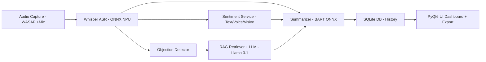

# PitchAI - Copiloto de Vendas NPU-Powered

> **O primeiro copiloto de vendas nativo do Windows que opera 100% offline, aproveitando a NPU do Snapdragon X+ para análise de IA em tempo real.**

## Visão Geral

O **PitchAI** é um pipeline de **IA multimodal para chamadas de vendas**, projetado para rodar totalmente no dispositivo. Ele combina:

* **Captura de Áudio** (WASAPI loopback + microfone)
* **ASR**: Transcrição em tempo real (Whisper ONNX)
* **Análise de Sentimento Multi-Dimensional** (texto + prosódia + visão opcional)
* **Objeções + RAG**: Detecção + respostas inteligentes (Llama 3.1 on-device)
* **Resumo Pós-Chamada**: Insights estruturados, métricas e próximos passos
* **Histórico Persistente**: SQLite criptografado, com busca textual/semântica

### Diferenciais Técnicos

* **Execução na NPU (QNN EP)** → latência <200ms, consumo mínimo de CPU/GPU.
* **Arquitetura modular** → cada feature implementada como serviço independente orquestrado via EventBus.
* **Segurança por design** → nenhum dado sai do notebook; toda a inferência é local.

---

## Arquitetura do Sistema



---

##  Features Core

###  **Feature 1: Captura de Áudio do Sistema**
* **Tecnologia**: PyAudio + WASAPI loopback
* **Formato**: PCM 16-bit, 16kHz, mono
* **Separação**: Microfone (vendedor) + loopback (cliente)
* **Latência alvo**: <64ms E2E
* **Output**: Buffer de áudio com timestamp + canal

###  **Feature 2: Transcrição em Tempo Real**
* **Modelo**: Whisper-base (39MB ONNX, quantizado INT8 FP16)
* **Execução**: ONNX Runtime + QNN Execution Provider
* **Chunking**: 3–5 segundos
* **Latência**: <200ms pós-chunk
* **Output JSON**:

```json
{
  "call_id": "123",
  "source": "cliente",
  "ts_start_ms": 1000,
  "ts_end_ms": 5000,
  "text": "Está muito caro",
  "confidence": 0.94
}
```

###  **Feature 3: Análise de Sentimento Multi-Dimensional**
* **Modelos**: DistilBERT (texto) + Wav2Vec2 (voz) + HRNet (visão, opcional)
* **Dimensões**: Sentimento, engajamento, sinais de compra, alertas por keyword
* **Latência**: <500ms (janela deslizante)
* **Dashboard**:

```
😊 Sentimento: 72% positivo
🎯 Engajamento: 85% alto
⚡ Sinais de compra: 3 detectados
🚨 Alerta: "preço" mencionado 2x
```

###  **Feature 4: RAG para Quebra de Objeções**
* **Detecção**: Classificação em {Preço, Timing, Autoridade, Necessidade}
* **Base de Conhecimento**: SQLite + embeddings (FAISS)
* **Modelo**: Llama 3.2 3B quantizado (LLM Service local, NPU)
* **Pipeline**:

  1. Detecta objeção via transcrição
  2. Recupera documentos relevantes
  3. Reranking + prompt RAG no LLM
  4. Sugestões (1–3 respostas curtas, com score e fontes)
* **Exemplo**:

```
🚨 OBJEÇÃO: "Preço muito alto"
💡 Sugestões:
1. [90%] "Vamos falar sobre ROI..."
2. [85%] "Esse ponto é importante..."
```

###  **Feature 5: Resumo Pós-Chamada Inteligente**
* **Modelo**: BART-large (ONNX, NPU)
* **Estrutura do Resumo**:

  * **Pontos Principais**
  * **Objeções Tratadas**
  * **Próximos Passos** (checklist)
  * **Performance (KPIs)**
* **Latência**: ≤ 3s após fim da chamada
* **Export**: PDF/Markdown
* **Output JSON**:

```json
{
  "key_points": ["Equipe de 50 pessoas", "Budget R$50-80k"],
  "objections": [{"type":"preco","handled":true}],
  "next_steps":[{"desc":"Enviar proposta","due":"2025-01-17"}],
  "metrics":{"talk_time_vendor_pct":0.45,"sentiment_avg":0.78}
}
```

###  **Feature 6: Histórico das Ligações**
* **Armazenamento**: SQLite criptografado + FTS5 (busca textual)
* **Dados armazenados**: transcrição, resumo, KPIs, objeções, sinais
* **Busca**: Full-text + semântica (embeddings locais)
* **Retenção**: configurável (default 180 dias)
* **Exportação**: resumo-only ou full transcript (opt-in)

---

##  Hackathon Strategy

###  Maximização de Pontuação
- **Implementação Técnica (40%)**: Pipeline NPU complexo com 5+ modelos simultâneos
- **Inovação (25%)**: Paradigma "always-on" único da NPU
- **Processamento Local (15%)**: 100% offline, zero dados externos
- **Implantação (10%)**: Executável único Windows
- **Apresentação (10%)**: Demo profissional + documentação completa

###  Diferencial Competitivo
> *"Enquanto outros projetos usam a NPU para uma tarefa isolada, o PitchAI cria um **ecossistema de IA sempre ativo** que transforma qualquer laptop em um assistente de vendas inteligente."*

---

##  Stack Tecnológica

| Categoria      | Tecnologia                         | Justificativa                    |
| -------------- | ---------------------------------- | -------------------------------- |
| **Linguagem**  | Python 3.11+                       | Ecossistema IA, suporte ONNX     |
| **AI Runtime** | ONNX Runtime + QNN EP (NPU)        | Execução otimizada, quantização  |
| **Frontend**   | PyQt6 + Glassmorphism              | UI nativa, responsiva            |
| **Database**   | SQLite + FTS5 + criptografia       | Leve, embarcado, busca eficiente |
| **Audio**      | PyAudio + WASAPI loopback          | Captura transparente             |
| **RAG Engine** | FAISS + LLM Service (Llama 3.2 3B) | Busca vetorial + geração local   |
| **Summarizer** | BART-large ONNX (quantizado)       | Síntese de alto nível            |

---

##  Estrutura do Projeto

```
PitchAI/
├── 📁 src/
│   ├── 📁 core/           # Motor principal da aplicação
│   ├── 📁 ai/             # Modelos e pipeline NPU
│   ├── 📁 audio/          # Captura e processamento
│   ├── 📁 ui/             # Interface PyQt6
│   └── 📁 data/           # Gerenciamento SQLite
├── 📁 models/             # Modelos ONNX otimizados
├── 📁 docs/               # Documentação técnica completa
├── 📁 tests/              # Suite de testes
├── 📁 scripts/            # Utilitários e deployment
└── 📄 requirements.txt    # Dependências Python
```

---

##  Quick Start

###  Pré-requisitos
- Windows 11 com Snapdragon X+
- Python 3.11+
- ONNX Runtime com QNN Execution Provider

###  Instalação Rápida
```bash
# Clone o repositório
git clone https://github.com/seu-usuario/PitchAI.git
cd PitchAI

# Setup automatizado (recomendado)
python setup.py

# Ative o ambiente virtual
venv\Scripts\activate

# Execute o PitchAI
python src/main.py
```

>  **Setup detalhado**: [INSTALL.md](INSTALL.md) | [docs/setup.md](docs/setup.md)

###  Demo em 30 Segundos
1. **Abra PitchAI** → Modelos carregam automaticamente na NPU
2. **Inicie uma chamada** → Detecção automática de áudio
3. **Fale naturalmente** → Transcrição + análise em tempo real
4. **Veja sugestões** → IA detecta objeções e sugere respostas
5. **Termine a chamada** → Resumo automático gerado

---

##  Documentação

-  [**Documentação Completa**](./docs/README.md)

-  [**Features Detalhadas**](./docs/features.md)
-  [**MVP Hackathon**](./docs/mvp-hackathon.md)
-  [**Setup e Instalação**](./docs/setup.md)

---

##  Contribuição

1. Fork o projeto
2. Crie uma branch para sua feature (`git checkout -b feature/FeatureManeira`)
3. Commit suas mudanças (`git commit -m 'Adicionando uma feature maneira'`)
4. Push para a branch (`git push origin feature/FeatureManeira`)
5. Abra um Pull Request

---

##  Licença

Este projeto está licenciado sob a licença MIT - veja o arquivo [LICENSE](LICENSE.md) para detalhes.
