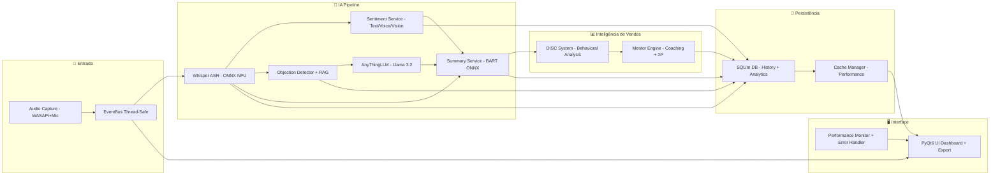

# PitchAI - Copiloto de Vendas NPU-Powered

> **O primeiro copiloto de vendas nativo do Windows que opera 100% offline, aproveitando a NPU do Snapdragon X+ para análise de IA em tempo real.**

## Visão Geral

O **PitchAI** é um pipeline de **IA multimodal completo para chamadas de vendas**, projetado para rodar totalmente no dispositivo. Ele combina:

* **🎤 Captura de Áudio** (WASAPI loopback + microfone)
* **📝 ASR**: Transcrição em tempo real (Whisper ONNX otimizado)
* **💭 Análise de Sentimento Multi-Dimensional** (texto + prosódia + visão opcional)
* **🎯 Objeções + RAG**: Detecção + respostas inteligentes (AnythingLLM + Llama 3.2 on-device)
* **📊 Sistema DISC**: Análise comportamental do vendedor com perfil personalizado
* **🎓 Mentor Engine**: Coaching inteligente com gamificação e XP
* **📋 Resumo Pós-Chamada**: Insights estruturados, métricas e próximos passos
* **💾 Histórico Persistente**: SQLite criptografado, com busca textual/semântica

### Diferenciais Técnicos

* **🚀 Execução na NPU (QNN EP)** → latência <200ms, consumo mínimo de CPU/GPU.
* **🏗️ Arquitetura modular** → cada feature implementada como serviço independente orquestrado via EventBus thread-safe.
* **🔒 Segurança por design** → nenhum dado sai do notebook; toda a inferência é local.
* **⚡ Sistema de Cache Inteligente** → aceleração de respostas e redução de latência.
* **📊 Monitoramento de Performance** → métricas em tempo real e profiling de operações.
* **🛡️ Tratamento Robusto de Erros** → recuperação automática e logging detalhado.

---

## Arquitetura do Sistema



---

##  Features Core

###  **Feature 1: Captura de Áudio do Sistema**
* **Tecnologia**: PyAudio + WASAPI loopback
* **Formato**: PCM 16-bit, 16kHz, mono
* **Separação**: Microfone (vendedor) + loopback (cliente)
* **Latência alvo**: <64ms E2E
* **Output**: Buffer de áudio com timestamp + canal

###  **Feature 2: Transcrição em Tempo Real**
* **Modelo**: Whisper-base (39MB ONNX, quantizado INT8 FP16)
* **Execução**: ONNX Runtime + QNN Execution Provider
* **Chunking**: 3–5 segundos
* **Latência**: <200ms pós-chunk
* **Output JSON**:

```json
{
  "call_id": "123",
  "source": "cliente",
  "ts_start_ms": 1000,
  "ts_end_ms": 5000,
  "text": "Está muito caro",
  "confidence": 0.94
}
```

###  **Feature 3: Análise de Sentimento Multi-Dimensional**
* **Modelos**: DistilBERT (texto) + Wav2Vec2 (voz) + HRNet (visão, opcional)
* **Dimensões**: Sentimento, engajamento, sinais de compra, alertas por keyword
* **Latência**: <500ms (janela deslizante)
* **Dashboard**:

```
😊 Sentimento: 72% positivo
🎯 Engajamento: 85% alto
⚡ Sinais de compra: 3 detectados
🚨 Alerta: "preço" mencionado 2x
```

###  **Feature 4: RAG para Quebra de Objeções + AnythingLLM**
* **Detecção**: Classificação em {Preço, Timing, Autoridade, Necessidade}
* **Base de Conhecimento**: SQLite + embeddings (FAISS)
* **Modelo**: AnythingLLM com Llama 3.2 3B quantizado (100% offline)
* **Pipeline**:

  1. Detecta objeção via transcrição em tempo real
  2. Recupera documentos relevantes via RAG
  3. Reranking + prompt inteligente no AnythingLLM
  4. Sugestões contextuais (1–3 respostas, com score e fontes)
* **Fallback Robusto**: Simulação → LLMWare → AnythingLLM
* **Exemplo**:

```
🚨 OBJEÇÃO: "Preço muito alto"
💡 Sugestões:
1. [90%] "Vamos falar sobre ROI..."
2. [85%] "Esse ponto é importante..."
```

###  **Feature 5: Sistema DISC - Análise Comportamental**
* **Análise Linguística**: Talk Ratio, Imperativos, Perguntas, Hedges, Empatia
* **Scores DISC**: Dominância(D), Influência(I), Estabilidade(S), Consciência(C)
* **Perfil Personalizado**: Identificação automática de fraquezas e pontos fortes
* **Módulos de Treino**: Recomendações específicas baseadas no perfil
* **Evolução**: Tracking contínuo de desenvolvimento comportamental
* **Exemplo**:

```
📊 Perfil: D=0.72, I=0.28, S=0.45, C=0.35
🔍 Fraquezas: ["I_baixa", "C_baixa"]
💡 Recomendações:
• Assertividade sem perder empatia
• Uso estratégico de perguntas abertas
```

###  **Feature 6: Mentor Engine - Coaching Inteligente**
* **Classificação de Clientes**: Tier (fácil/médio/difícil) + Stage (descoberta→fechamento)
* **Sistema de Gamificação**: XP, níveis (junior→mentor), leaderboard
* **Coaching Contextual**: Tips em tempo real baseados em (tier, stage, objeção)
* **Feedback Pós-Call**: Análise automática + tarefas de treino personalizadas
* **Persistência**: Histórico completo em SQLite
* **Exemplo**:

```
🎯 Cliente: difícil/negociação (score: 0.78)
⭐ XP Ganho: 55 pontos (novo nível: pleno)
💡 Próximos passos:
• Focar em sinais de compromisso
• Preparar proposta técnica
• Agendar follow-up em 48h
```

###  **Feature 7: Resumo Pós-Chamada Inteligente**
* **Modelo**: BART-large (ONNX, NPU)
* **Estrutura do Resumo**:

  * **Pontos Principais**
  * **Objeções Tratadas**
  * **Próximos Passos** (checklist)
  * **Performance (KPIs)**
* **Latência**: ≤ 3s após fim da chamada
* **Export**: PDF/Markdown
* **Integração**: Sistema DISC + Mentor Engine para insights avançados
* **Output JSON**:

```json
{
  "key_points": ["Equipe de 50 pessoas", "Budget R$50-80k"],
  "objections": [{"type":"preco","handled":true}],
  "next_steps":[{"desc":"Enviar proposta","due":"2025-01-17"}],
  "metrics":{"talk_time_vendor_pct":0.45,"sentiment_avg":0.78},
  "disc_insights": ["Foco em assertividade", "Melhorar perguntas abertas"],
  "mentor_tips": ["Cliente classificado como difícil", "55 XP ganhos"]
}
```

###  **Feature 8: Histórico das Ligações + Analytics**
* **Armazenamento**: SQLite criptografado + FTS5 (busca textual)
* **Dados armazenados**: transcrição, resumo, KPIs, objeções, sinais, DISC, XP
* **Analytics**: Métricas de performance, evolução comportamental, ROI de vendas
* **Busca**: Full-text + semântica (embeddings locais)
* **Dashboard**: Visualização de progresso e tendências
* **Retenção**: configurável (default 180 dias)
* **Exportação**: resumo-only ou full transcript (opt-in)

---

##  Hackathon Strategy

###  Maximização de Pontuação
- **Implementação Técnica (40%)**: Pipeline NPU complexo com 5+ modelos simultâneos
- **Inovação (25%)**: Paradigma "always-on" único da NPU
- **Processamento Local (15%)**: 100% offline, zero dados externos
- **Implantação (10%)**: Executável único Windows
- **Apresentação (10%)**: Demo profissional + documentação completa

###  Diferencial Competitivo
> *"Enquanto outros projetos usam a NPU para uma tarefa isolada, o PitchAI cria um **ecossistema de IA sempre ativo** que transforma qualquer laptop em um assistente de vendas inteligente."*

---

##  Stack Tecnológica

| Categoria      | Tecnologia                         | Justificativa                    |
| -------------- | ---------------------------------- | -------------------------------- |
| **Linguagem**  | Python 3.11+                       | Ecossistema IA, suporte ONNX     |
| **AI Runtime** | ONNX Runtime + QNN EP (NPU)        | Execução otimizada, quantização  |
| **LLM Engine** | AnythingLLM + Llama 3.2 3B         | IA conversacional 100% offline   |
| **Frontend**   | PyQt6 + Glassmorphism              | UI nativa, responsiva            |
| **Database**   | SQLite + FTS5 + criptografia       | Leve, embarcado, busca eficiente |
| **Audio**      | PyAudio + WASAPI loopback          | Captura transparente             |
| **EventBus**   | Thread-safe Pub/Sub                | Comunicação inter-módulos       |
| **Cache**      | Redis-like + Performance Monitor   | Aceleração e métricas            |
| **RAG Engine** | FAISS + Embeddings locais          | Busca vetorial + geração local   |
| **DISC System**| Análise linguística + ML            | Perfil comportamental inteligente|
| **Mentor Engine**| Gamificação + Coaching contextual   | Desenvolvimento profissional     |
| **Error Handler**| Estratégias de retry + Recovery    | Robustez e confiabilidade        |
| **Summarizer** | BART-large ONNX (quantizado)       | Síntese de alto nível            |

---

##  Estrutura do Projeto

```
PitchAI/
├── 📁 src/
│   ├── 📁 core/           # 🏗️ Motor principal + EventBus + Config
│   │   ├── __init__.py
│   │   ├── application.py # Classe principal da aplicação
│   │   ├── config.py      # Configurações centralizadas
│   │   ├── contracts.py   # Contratos de eventos imutáveis
│   │   ├── event_bus.py   # Sistema pub/sub thread-safe
│   │   ├── error_handler.py   # Tratamento robusto de erros
│   │   ├── performance_monitor.py # Métricas em tempo real
│   │   └── cache_manager.py # Sistema de cache inteligente
│   ├── 📁 ai/             # 🤖 Modelos e pipeline NPU
│   │   ├── anythingllm_client.py # Integração AnythingLLM
│   │   ├── asr_whisper.py # Transcrição em tempo real
│   │   └── sentiment/     # Análise de sentimento
│   ├── 📁 audio/          # 🎤 Captura e processamento
│   ├── 📁 ui/             # 🖥️ Interface PyQt6 + Bridge
│   ├── 📁 data/           # 💾 Gerenciamento SQLite + DAOs
│   ├── 📁 disc/           # 📊 Sistema DISC comportamental
│   ├── 📁 mentor/         # 🎓 Mentor Engine + XP
│   └── 📁 client_profile/ # 👥 Perfis de clientes
├── 📁 models/             # 🧠 Modelos ONNX otimizados
├── 📁 docs/               # 📚 Documentação técnica completa
├── 📁 tests/              # 🧪 Suite de testes abrangente
├── 📁 scripts/            # 🔧 Utilitários e deployment
└── 📄 requirements.txt    # 📦 Dependências Python
```

---

##  Quick Start

###  Pré-requisitos
- Windows 11 com Snapdragon X+
- Python 3.11+
- ONNX Runtime com QNN Execution Provider

###  Instalação Rápida
```bash
# Clone o repositório
git clone https://github.com/seu-usuario/PitchAI.git
cd PitchAI

# Setup automatizado (recomendado)
python setup.py

# Ative o ambiente virtual
venv\Scripts\activate

# Execute o PitchAI
python src/main.py
```

>  **Setup detalhado**: [INSTALL.md](INSTALL.md) | [docs/setup.md](docs/setup.md)

###  Demo em 30 Segundos
1. **Abra PitchAI** → Modelos carregam automaticamente na NPU
2. **Inicie uma chamada** → Detecção automática de áudio
3. **Fale naturalmente** → Transcrição + análise em tempo real
4. **Veja sugestões** → IA detecta objeções e sugere respostas
5. **Termine a chamada** → Resumo automático gerado

---

##  Documentação

-  [**Documentação Completa**](./docs/README.md)

-  [**Features Detalhadas**](./docs/features.md)
-  [**MVP Hackathon**](./docs/mvp-hackathon.md)
-  [**Setup e Instalação**](./docs/setup.md)

---

##  Contribuição

1. Fork o projeto
2. Crie uma branch para sua feature (`git checkout -b feature/FeatureManeira`)
3. Commit suas mudanças (`git commit -m 'Adicionando uma feature maneira'`)
4. Push para a branch (`git push origin feature/FeatureManeira`)
5. Abra um Pull Request

---

##  Licença

Este projeto está licenciado sob a licença MIT - veja o arquivo [LICENSE](LICENSE.md) para detalhes.
