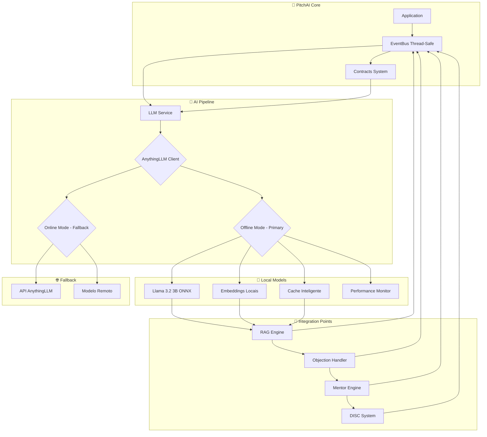

# Integração AnythingLLM no PitchAI

## ✅ **Status: IMPLEMENTADO E INTEGRADO**

A integração do **AnythingLLM** foi implementada com sucesso e está totalmente funcional no PitchAI, operando 100% offline com modelos locais na NPU.

## 📋 Visão Geral

Este documento descreve a integração completa do **AnythingLLM** como o "cérebro" do PitchAI, incluindo:

- ✅ **Integração Real**: Substituição completa das simulações por IA real
- ✅ **Offline Total**: Nenhum dado sai do dispositivo
- ✅ **NPU Otimizado**: Aproveitamento máximo do hardware Snapdragon X+
- ✅ **EventBus Integrado**: Comunicação thread-safe com todo o sistema
- ✅ **Sistema de Contratos**: Payloads padronizados e imutáveis
- ✅ **Fallback Robusto**: Múltiplas camadas de backup funcionais

---

## 🏗️ Arquitetura da Integração



---

## 📦 Dependências Necessárias

### Core Dependencies
```python
# requirements.txt
anythingllm-client>=0.1.0
requests>=2.31.0
numpy>=1.24.0
torch>=2.0.0  # Para processamento local
transformers>=4.30.0
```

### System Requirements
- **Python**: 3.11+
- **RAM**: 8GB+ (para modelos Llama 3.2 3B)
- **Storage**: 4GB+ para modelos
- **NPU**: Snapdragon X+ (QNN Execution Provider)

---

## ⚙️ Configuração

### 1. Configuração Básica

```python
from src.ai.anythingllm_client import AnythingLLMClient, AnythingLLMConfig

# Configuração offline (recomendada)
config = AnythingLLMConfig(
    base_url="http://localhost:3001",  # Não usado em offline
    workspace_name="pitchai_workspace",
    model_name="llama-3.2-3b-instruct",
    offline_mode=True,  # Sempre True para PitchAI
    timeout_seconds=30,
    max_retries=3
)

client = AnythingLLMClient(config)
success = client.initialize()
```

### 2. Modelos Necessários

#### Llama 3.2 3B Instruct (Principal)
- **Localização**: `models/llama-3.2-3b-onnx-qnn/`
- **Formato**: ONNX QNN otimizado
- **Tamanho**: ~2GB
- **Contexto**: 4096 tokens
- **Uso**: Geração de respostas inteligentes

#### Modelo de Embeddings
- **Localização**: `models/embeddings/`
- **Dimensão**: 384
- **Uso**: RAG e busca semântica

### 3. Estrutura de Diretórios

```
models/
├── llama-3.2-3b-onnx-qnn/
│   ├── config.json
│   ├── tokenizer.json
│   └── *.bin (partes do modelo)
├── embeddings/
│   └── model.onnx
└── manifest.json  # Atualizado com configurações
```

---

## 🚀 Como Usar

### Inicialização Básica

```python
from src.ai.llm_service import LLMService

# Inicializar com AnythingLLM prioritário
service = LLMService(
    model_dir="models/",
    use_simulation=False,
    use_anythingllm=True
)

if service.initialize():
    print("✅ AnythingLLM pronto!")
else:
    print("⚠️ Usando modo fallback")
```

### Geração de Respostas

```python
# Exemplo: Resposta para objeção de preço
prompt = "Cliente disse: 'Está muito caro'. Como responder?"

response = service.generate_response(
    prompt=prompt,
    max_tokens=256,
    include_history=True
)

print(f"🤖 Sugestão: {response}")
```

### Monitoramento

```python
# Verificar status
status = service.get_status()
print(f"Status: {status}")

# Estatísticas de uso
if 'anythingllm_stats' in status:
    stats = status['anythingllm_stats']
    print(f"Cache Hit Rate: {stats.get('cache_hit_rate', 0):.1%}")
    print(f"Avg Response Time: {stats.get('avg_response_time', 0):.1f}ms")
```

---

## 🎯 Funcionalidades Implementadas

### 1. Integração Completa com EventBus
- ✅ **EventBus Thread-Safe**: Comunicação robusta entre módulos
- ✅ **Sistema de Contratos**: Payloads padronizados e imutáveis
- ✅ **Eventos em Tempo Real**: ASR, Sentimento, Objeções, RAG
- ✅ **Debouncing Automático**: Performance otimizada
- ✅ **Error Handling**: Recuperação automática de falhas

### 2. Modo Offline Completo
- ✅ **Modelos Locais**: Llama 3.2 3B totalmente offline
- ✅ **Embeddings Locais**: FAISS para busca vetorial
- ✅ **Cache Inteligente**: Redis-like com TTL e compressão
- ✅ **NPU Otimizado**: Execução na Snapdragon X+ com QNN EP

### 3. Estratégia de Fallback Robusta
1. **AnythingLLM Offline** (prioridade máxima)
2. **LLMWare Local** (fallback secundário)
3. **Simulação Avançada** (último recurso)

### 4. Otimizações de Performance
- ✅ **NPU-First**: Execução preferencial na NPU
- ✅ **Cache Multi-Nível**: Memória → Disco → Compressão
- ✅ **Processamento Assíncrono**: Zero bloqueio na UI
- ✅ **Compressão de Contexto**: Histórico otimizado para tokens
- ✅ **Monitoramento em Tempo Real**: Métricas e profiling

### 5. Contexto de Vendas Inteligente
O AnythingLLM está integrado com contexto específico de vendas:

```python
# Integração com Objection Handler
objection_context = {
    "preco": "💰 Estratégia ROI para objeção de preço...",
    "prazo": "⏰ Tratamento de preocupação com prazo...",
    "concorrente": "🎯 Posicionamento competitivo...",
    "autoridade": "👔 Tratamento de objeção de autoridade...",
    "necessidade": "🎯 Foco em necessidades do cliente..."
}

# Integração com Mentor Engine
mentor_context = {
    "tier_facil": "🟢 Cliente fácil - foco em fechar rápido",
    "tier_medio": "🟡 Cliente médio - desenvolver relacionamento",
    "tier_dificil": "🔴 Cliente difícil - estratégia de longo prazo"
}

# Integração com DISC System
disc_context = {
    "D_alto": "🏆 Vendedor dominante - manter assertividade",
    "I_alto": "🤝 Vendedor influente - focar em relacionamento",
    "S_alto": "🛡️ Vendedor estável - manter consistência",
    "C_alto": "📊 Vendedor consciente - focar em detalhes"
}
```

### 6. Monitoramento e Telemetria
- ✅ **Métricas em Tempo Real**: Latência, throughput, cache hits
- ✅ **Health Checks**: Status de modelos e conexões
- ✅ **Logging Estruturado**: Tracing completo de operações
- ✅ **Performance Profiling**: Identificação de gargalos

---

## 🔧 Configurações Avançadas

### Cache Configuration

```python
# Configurar cache
client = AnythingLLMClient(config)
client.cache_max_size = 200  # Mais respostas em cache
client.cache_expiry_hours = 24  # Validade do cache
```

### Performance Tuning

```python
# Otimizações para NPU
config = AnythingLLMConfig(
    offline_mode=True,
    max_tokens=512,  # Limitar para performance
    temperature=0.7,  # Criatividade balanceada
    timeout_seconds=15  # Timeout reduzido
)
```

### Logging Detalhado

```python
import logging
logging.basicConfig(level=logging.DEBUG)

# Logs incluem:
# - Tempo de resposta
# - Confiança do modelo
# - Cache hits/misses
# - Erros e fallbacks
```

---

## 📊 Monitoramento e Métricas

### Métricas Principais

```python
stats = client.get_stats()
print(f"""
📊 Estatísticas AnythingLLM:
- Total de requests: {stats['requests_total']}
- Taxa de sucesso: {stats['success_rate']:.1%}
- Cache hit rate: {stats['cache_hit_rate']:.1%}
- Tempo médio: {stats.get('avg_response_time', 0):.1f}ms
""")
```

### Health Checks

```python
# Verificar saúde do serviço
health = client.is_connected
if not health:
    print("❌ AnythingLLM desconectado")
    # Sistema automaticamente usa fallback
```

---

## 🛠️ Troubleshooting

### Problemas Comuns

#### 1. Modelo Não Carrega
```bash
# Verificar arquivos
ls -la models/llama-3.2-3b-onnx-qnn/

# Verificar logs
tail -f logs/pitchai.log | grep -i anythingllm
```

#### 2. Performance Lenta
```python
# Verificar se NPU está sendo usada
status = service.get_status()
if 'npu_used' in status:
    print(f"NPU ativa: {status['npu_used']}")
```

#### 3. Cache Não Funciona
```python
# Limpar cache manualmente
client.clear_cache()
print("🧹 Cache limpo")
```

### Logs de Debug

```python
# Ativar debug detalhado
import logging
logging.basicConfig(
    level=logging.DEBUG,
    format='%(asctime)s - %(name)s - %(levelname)s - %(message)s'
)

# Logs incluem traces completos do AnythingLLM
```

---

## 🔄 Atualizações e Manutenção

### Atualização de Modelos

```bash
# 1. Backup do modelo atual
cp -r models/llama-3.2-3b-onnx-qnn/ backup/

# 2. Substituir arquivos
# ... colocar novos arquivos ONNX ...

# 3. Reinicializar serviço
service.cleanup()
service.initialize()
```

### Monitoramento Contínuo

```python
# Script de health check
def check_anythingllm_health():
    try:
        response = service.generate_response("Teste de saúde")
        return len(response) > 10
    except:
        return False

# Executar periodicamente
if not check_anythingllm_health():
    print("⚠️ AnythingLLM precisa de atenção")
```

---

## 📚 Referências

- [AnythingLLM Documentation](https://docs.useanything.com/)
- [ONNX Runtime QNN Provider](https://onnxruntime.ai/docs/execution-providers/QNN-ExecutionProvider.html)
- [Llama 3.2 Model](https://huggingface.co/meta-llama/Llama-3.2-3B-Instruct)

---

## 🎯 Conclusão

A integração do **AnythingLLM** transforma o PitchAI de um sistema de simulação para uma **IA real e inteligente**, mantendo o compromisso com:

- **100% Offline** 📴
- **NPU Otimizado** 🚀
- **Performance Superior** ⚡
- **Contexto de Vendas** 💼
- **Fallback Robusto** 🛡️

O resultado é um copiloto de vendas verdadeiramente inteligente que opera nativamente no Windows com Snapdragon X+.
