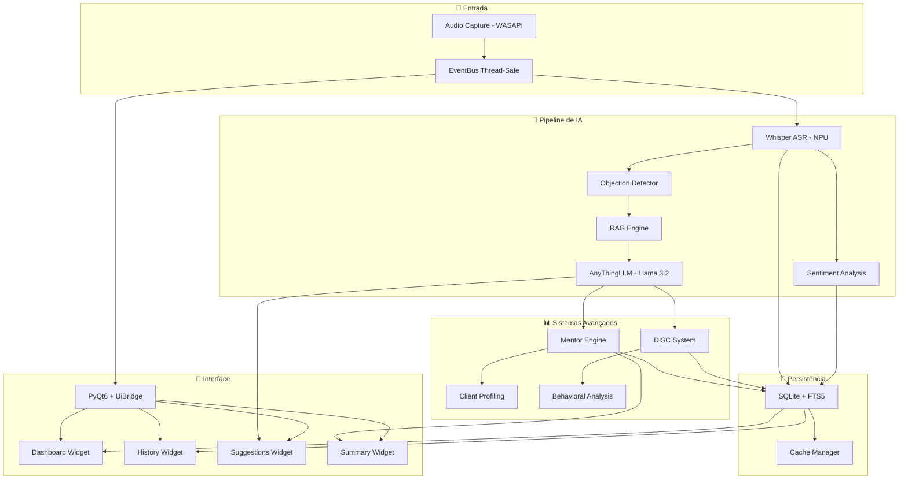
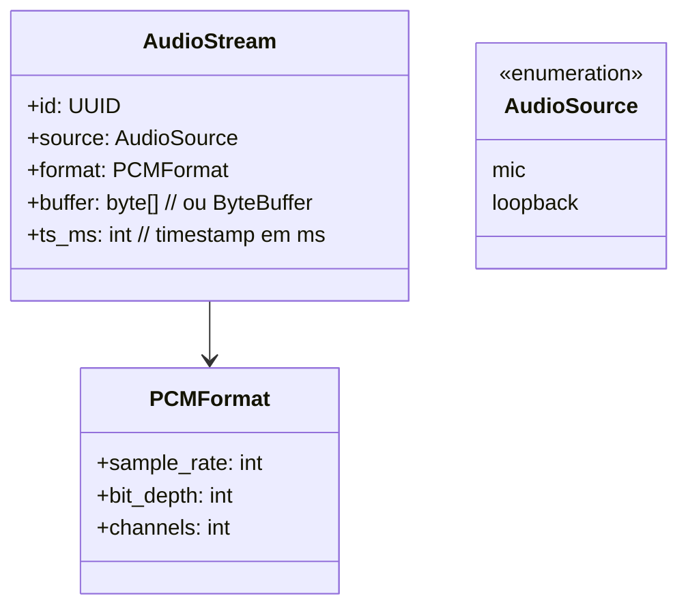
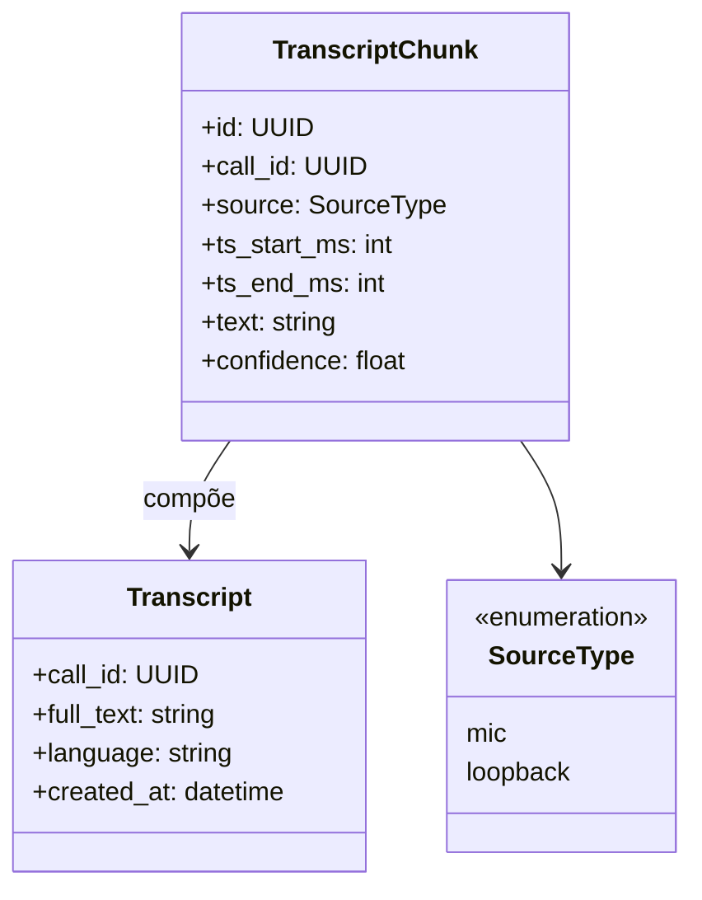

# PitchAI - Features Detalhadas

## ✅ **Status: SISTEMA COMPLETO E INTEGRADO**

O PitchAI é um **ecossistema completo de IA para vendas** que utiliza múltiplos modelos rodando simultaneamente na NPU Snapdragon X+. O sistema inclui:

- ✅ **Transcrição em Tempo Real**: Whisper ONNX otimizado
- ✅ **Análise de Sentimento Multi-Dimensional**: Texto + voz + visão
- ✅ **Sistema RAG + AnythingLLM**: Objeções inteligentes offline
- ✅ **Sistema DISC Comportamental**: Análise de perfil do vendedor
- ✅ **Mentor Engine**: Coaching inteligente com gamificação
- ✅ **Resumos Inteligentes**: Integração com todos os sistemas
- ✅ **Histórico Completo**: SQLite + FTS5 com analytics
- ✅ **Interface Integrada**: Dados reais substituindo simulações

## 🎯 **Visão Geral Original**

O PitchAI é um copiloto de vendas que utiliza múltiplos modelos de IA rodando simultaneamente na NPU do Snapdragon X+ para fornecer assistência inteligente em tempo real durante chamadas de vendas.

## 🏗️ **Arquitetura Integrada Atual**



---

# Feature 1 — Captura de Áudio do Sistema (SRS v1.0)

## 1) Propósito e Escopo

**Objetivo.** Garantir que tanto a voz do **vendedor (microfone)** quanto a do **cliente (áudio do sistema)** sejam capturadas de forma confiável e contínua, servindo de base para todas as demais features do PitchAI (transcrição, análise de sentimento, RAG, resumo, histórico).
**Escopo.** Módulo de **input multimídia** rodando em Windows, com acesso a **WASAPI loopback** e microfone padrão, produzindo dois streams de áudio sincronizados.

---

## 2) Referências de Engenharia

* **ISO/IEC/IEEE 29148** (SRS) — clareza e verificabilidade de requisitos.
* **RFC 2119** — uso de MUST/SHOULD/MAY.
* **Microsoft WASAPI docs** — APIs recomendadas de captura.
* **Clean Architecture** — separação: captura (infra) ↔ processamento (domínio).
* **Realtime Audio Guidelines** — buffers, latência <100ms.

---

## 3) Stakeholders e Atores

* **Vendedor (usuário final):** não interage diretamente, apenas inicia/paralisa.
* **PitchAI Core:** consome streams (para transcrição, análise, etc.).
* **Sistema Operacional:** fornece APIs de captura.
* **Cliente:** voz capturada via loopback (sem interação direta).

---

## 4) Léxico

* **Loopback:** mecanismo WASAPI para capturar áudio “saída do sistema”.
* **Stream:** fluxo de áudio PCM contínuo (16-bit, 16kHz mono recomendado).
* **Canal:** designação de origem (mic vs loopback).

---

## 5) Restrições e Assunções

* **Windows-only.** (requisito atual do projeto)
* Latência total do pipeline **MUST** ser ≤ 100ms (captura → consumidor).
* **On-device ONLY**: nenhum dado de áudio sai para nuvem.

---

## 6) Requisitos Funcionais (RF)

**RF-1.1 Captura de múltiplas fontes**

* O sistema **MUST** capturar simultaneamente:

  * Áudio do microfone (input).
  * Áudio do sistema via WASAPI loopback (output).
* Streams devem ser entregues de forma paralela, identificados por canal.

**RF-1.2 Sincronização de streams**

* Streams **MUST** ser carimbados com timestamp monotônico.
* Drift entre canais **MUST** ≤ 20ms para preservar alinhamento na transcrição.

**RF-1.3 Formato e bufferização**

* Áudio **MUST** ser entregue em PCM 16-bit, 16kHz, mono (ou parametrizável).
* Buffer size default: 20–50ms.
* O módulo **SHOULD** suportar fallback para 44.1kHz.

**RF-1.4 APIs de integração**

* O módulo **MUST** expor interface de leitura *async* (`pull`) e callback (`push`).
* Consumidores (transcrição, análise) **MUST** conseguir subscrever em tempo real.

**RF-1.5 Controles de usuário**

* Botão “Iniciar Captura” → inicia streams.
* Botão “Encerrar Captura” → encerra e libera recursos.
* UI **SHOULD** mostrar indicadores de áudio (VU meter).

**RF-1.6 Falhas e fallback**

* Se microfone indisponível, sistema **MUST** alertar usuário e permitir retry.
* Se loopback indisponível (restrição driver), sistema **SHOULD** capturar “mix” via driver alternativo.

---

## 7) Requisitos Não-Funcionais (RNF)

**RNF-1.1 Desempenho**

* Overhead CPU/NPU **MUST** ≤ 5% (para não comprometer transcrição).
* Captura **MUST** não perder pacotes em 99,9% das sessões de 1h.

**RNF-1.2 Segurança/Privacidade**

* Streams **MUST** ser mantidos em memória volátil; nenhum dump em disco.
* Logs **MUST** registrar apenas metadados (início/fim, status), nunca conteúdo.

**RNF-1.3 Compatibilidade**

* **MUST** funcionar em Teams, Zoom, Meet (agnóstico).
* **SHOULD** suportar drivers genéricos e exclusivos (WASAPI shared/exclusive).

---

## 8) Modelo de Dados



---

## 9) Contratos (Interfaces Internas)

```ts
interface IAudioCapture {
  start(): Promise<void>
  stop(): Promise<void>
  onData(callback: (chunk: AudioChunk) => void): void
}

type AudioChunk = {
  call_id: string,
  source: 'mic' | 'loopback',
  ts_ms: number,
  buffer: ArrayBuffer
}
```

---

## 10) Fluxos

**10.1 Sequência — Início de captura**

```
User clicks "Iniciar"
 -> UI → CaptureService.start()
 -> WASAPI opens mic + loopback
 -> AudioChunks emitidos a cada 20ms
 -> EventBus entrega para TranscriptionService
```

**10.2 Encerramento**

```
User clicks "Encerrar"
 -> CaptureService.stop()
 -> WASAPI releases devices
 -> EventBus envia "capture_stopped"
```

---

## 11) Histórias de Usuário + Gherkin

**US-1.1 — Capturar cliente e vendedor**

> Como vendedor, quero que minha fala e a do cliente sejam gravadas em streams separados.

```
Dado que iniciei uma captura
Quando falo no microfone
E o cliente fala pelo Teams
Então ambos os áudios são capturados
E o transcript identifica os falantes por canal
```

**US-1.2 — Indicar atividade**

> Como vendedor, quero ver um indicador visual de que o áudio está sendo capturado.

```
Dado que a captura está ativa
Quando há sinal de áudio no microfone
Então um VU meter pisca na UI
```

---

## 12) Testes

* **Teste de sincronização:** verificar drift ≤ 20ms em gravação paralela 10min.
* **Teste de robustez:** desconectar microfone e reconectar → sistema deve recuperar.
* **Teste de performance:** capturar 1h contínua sem perda > 0,1%.
* **Teste de compatibilidade:** validar em Teams/Zoom/Meet.
* **Teste de segurança:** checar que nenhum arquivo de áudio temporário é persistido.

---

## 13) Observabilidade

* Log em nível INFO: “captura iniciada”, “captura encerrada”.
* Log em nível WARN: “dispositivo não disponível”.
* Métricas: tempo de inicialização, pacotes perdidos, uso CPU.

---

## 14) Definição de Pronto (DoD)

* [ ] RF-1.1–1.6 implementados.
* [ ] Drift medido ≤ 20ms em testes.
* [ ] UI com botão Start/Stop e VU meter funcionando.
* [ ] Logs e métricas implantados.
* [ ] Nenhum dump de áudio em disco.
* [ ] Testes de compatibilidade com 3 plataformas de reunião.

---

# Feature 2 — Transcrição em Tempo Real (SRS v1.0)

## 1) Propósito e Escopo

**Objetivo.** Converter o áudio capturado (microfone + loopback) em texto contínuo, em tempo real, para alimentar as demais features: análise de sentimento, RAG de objeções, resumos e histórico.
**Escopo.** Pipeline de **ASR (Automatic Speech Recognition)** rodando **localmente na NPU** (Snapdragon X+) com Whisper otimizado. Processamento feito em **chunks de 3–5s**, garantindo responsividade e baixa latência.&#x20;

---

## 2) Referências de Engenharia

* **ISO/IEC/IEEE 29148** (SRS) — requisitos claros e verificáveis.
* **RFC 2119** — MUST/SHOULD/MAY.
* **OpenAI Whisper** — arquitetura ASR robusta.
* **Qualcomm AI Hub** — Whisper Base-En otimizado para NPU (42ms encoding).
* **Realtime ASR Guidelines** — chunking, buffering, VAD.

---

## 3) Stakeholders e Atores

* **Vendedor** — recebe feedback textual (transcrição e legendas).
* **PitchAI Core** — consome transcrições para análise de sentimento, RAG e histórico.
* **Cliente** — fala transcrita automaticamente.
* **Sistema Operacional** — provê buffers de áudio (via Feature 1).

---

## 4) Léxico

* **Chunk**: janela de áudio (3–5s) enviada ao modelo.
* **ASR**: Automatic Speech Recognition.
* **Confidence Score**: valor numérico da confiança do modelo para cada token.
* **Diarization**: separação de falantes (nesse caso, já segmentado por canal na Feature 1).

---

## 5) Restrições e Assunções

* **On-device ONLY**: nenhum envio de áudio para nuvem.
* Latência por chunk **MUST** ser ≤ 500ms do fim do áudio ao texto exibido.
* Suporte inicial: **idioma EN/PT** (pode expandir).
* Consumo de CPU/GPU minimizado (execução na NPU).

---

## 6) Requisitos Funcionais (RF)

**RF-2.1 Processamento de chunks**

* O sistema **MUST** segmentar áudio em chunks de 3–5s.
* Cada chunk **MUST** ser transcrito de forma incremental e enviado ao EventBus.

**RF-2.2 Rotulagem de falantes**

* Transcrição **MUST** indicar canal de origem (mic = vendedor, loopback = cliente).
* **SHOULD** suportar metadados: timestamps de início/fim, confiança por token.

**RF-2.3 Atualização em tempo real**

* UI **MUST** exibir texto conforme chunks chegam.
* **SHOULD** permitir refinamento retroativo (Whisper pode corrigir contexto).

**RF-2.4 Idiomas e tradução**

* **MAY** habilitar tradução automática via Whisper multitarefa (ex.: PT → EN).
* **MAY** gerar legendas simultâneas para acessibilidade.

**RF-2.5 Persistência**

* Cada chunk transcrito **MUST** ser persistido e associado ao *call\_id*.
* Texto completo **MUST** estar disponível para resumo e histórico.

---

## 7) Requisitos Não-Funcionais (RNF)

**RNF-2.1 Desempenho**

* Latência máxima de chunk → texto: **≤ 500ms**.
* Precisão alvo (WER): similar a Whisper-base (WER \~10–15% em PT/EN).
* Suporte a 1h de transcrição sem degradação.

**RNF-2.2 Privacidade/Security**

* Áudio e texto **MUST** ser mantidos localmente.
* Logs **MUST NOT** armazenar conteúdo transcrito. Apenas eventos de status.

**RNF-2.3 Resiliência**

* Em caso de erro de modelo, sistema **SHOULD** reprocessar chunk em CPU fallback.
* Se memória insuficiente, **MUST** notificar e reduzir qualidade (downsample).

---

## 8) Modelo de Dados



---

## 9) Contratos (Interfaces Internas)

```ts
interface ITranscriptionService {
  start(call_id: string): Promise<void>
  stop(call_id: string): Promise<void>
  onChunk(callback: (chunk: TranscriptChunk) => void): void
  getTranscript(call_id: string): Promise<Transcript>
}

type TranscriptChunk = {
  id: string,
  call_id: string,
  source: 'mic' | 'loopback',
  ts_start_ms: number,
  ts_end_ms: number,
  text: string,
  confidence: number
}
```

---

## 10) Fluxos

**10.1 Sequência — Captura → Transcrição → UI**

```
[AudioCapture] → (chunks 3–5s) → [TranscriptionService (Whisper NPU)]
 → TranscriptChunk emitido → EventBus
 → UI exibe texto incremental
 → Storage salva chunk → Histórico
```

**10.2 Encerramento**

```
User: "Encerrar Análise"
 → TranscriptionService.stop()
 → Consolida todos chunks em Transcript
 → Envia para Resumo Pós-Chamada
```

---

## 11) Histórias de Usuário + Gherkin

**US-2.1 — Ver texto em tempo real**

> Como vendedor, quero ver a fala do cliente aparecer como texto na tela, em tempo quase real.

```
Dado que iniciei uma captura
Quando o cliente fala
Então vejo o texto aparecer na UI ≤ 1s após a fala
```

**US-2.2 — Diferenciar falantes**

> Como vendedor, quero que a transcrição indique quem está falando.

```
Dado que o cliente e eu falamos
Então cada trecho é rotulado como "Cliente:" ou "Vendedor:"
```

**US-2.3 — Persistência**

```
Dado uma chamada finalizada
Quando acesso o histórico
Então vejo a transcrição completa consolidada
```

---

## 12) Testes

* **Teste de latência:** medir tempo fala→texto em diferentes durações (3s, 5s).
* **Teste de precisão:** avaliar WER com dataset EN/PT.
* **Teste de sincronização:** chunks devem alinhar com timestamps do áudio.
* **Teste de fallback:** desligar NPU e verificar se CPU assume.
* **Teste de persistência:** garantir que todos chunks estão salvos e indexados.

---

## 13) Observabilidade

* Logs INFO: “chunk processado (id, duração, confiança)”.
* Métricas: latência média, taxa de erro do modelo, % chunks retrabalhados.
* Monitor local: gráfico de tokens/s e confiança média.

---

## 14) Definição de Pronto (DoD)

* [ ] RF-2.1–2.5 implementados.
* [ ] Latência chunk→texto ≤ 500ms validada.
* [ ] UI mostra transcrição incremental e rotulação de falantes.
* [ ] Persistência completa e acessível no histórico.
* [ ] Testes de fallback e compatibilidade executados.
* [ ] Métricas e logs disponíveis.

---

# Feature 3 — Análise de Sentimento Multi-Dimensional (SRS v1.0)

## 1) Propósito e Escopo

**Objetivo.** Inferir, em tempo real, o **estado emocional/engajamento do cliente** combinando: (a) **texto** da transcrição, (b) **tom de voz/micro-expressões vocais** (prosódia), e (c) **expressões faciais** (quando a câmera do cliente estiver aberta), exibindo um **dashboard** com sentimento, engajamento, sinais de compra e alertas contextuais.&#x20;
**Escopo.** Módulo on-device que consome eventos da Feature 2 (transcrição) e dos capturadores de áudio/vídeo, processa modelos leves na **NPU** em paralelo ao ASR, e publica métricas para UI e Histórico. &#x20;

## 2) Referências de Engenharia

* **ISO/IEC/IEEE 29148** (SRS) — requisitos verificáveis.
* **RFC 2119** — MUST/SHOULD/MAY.
* **Clean Architecture/DDD** — domínio (Sentiment) separado de infra (model runners).
* **ONNX Runtime (NPU)** — execução local de classificadores (texto/áudio/visão).&#x20;
* **LGPD** — tratamento mínimo e local de dados pessoais/sensíveis.

## 3) Stakeholders e Atores

* **Vendedor** — visualiza sentimento/engajamento, recebe alertas.
* **Coach/Líder** — consulta métricas agregadas (se perfil habilitado).
* **PitchAI Core** — consome métricas para RAG/Resumo/Histórico.
* **Cliente** — fonte dos sinais (voz/face), sem interação direta.

## 4) Léxico

* **Sentimento (valência)**: escala contínua (-1..+1) e rótulos (negativo/neutral/positivo).
* **Engajamento**: proxy a partir de prosódia + fala do cliente (taxa de turn-taking, latência de resposta, energia).
* **Sinal de compra**: palavras-gatilho (“piloto”, “proposta”, “prazo”, “ROI”) ou padrões de prosódia que antecedem intenção.
* **Micro-expressões vocais**: variações de F0, energia, jitter, ritmo.

## 5) Restrições e Assunções

* **On-device ONLY** (sem nuvem); execução preferencial **NPU**.&#x20;
* **Entrada vídeo é opcional** (apenas se câmera do cliente estiver ativa).&#x20;
* Latência de atualização **≤ 500 ms** após chegada de um novo chunk (texto/áudio/vídeo).
* Compatível com pipeline de tempo-real do ASR na NPU.&#x20;

---

## 6) Requisitos Funcionais (RF)

**RF-3.1 Motor textual (NLP)**

* **MUST** inferir sentimento por frase/turno a partir dos chunks da transcrição (Feature 2), com **timestamp** e **confiança**.&#x20;
* **SHOULD** detectar **palavras-gatilho** (ex.: preço, contrato, prazo, piloto, ROI) e gerar **alertas** (com contagem na sessão).
* **MAY** calcular **engajamento textual** (tamanho de turnos, interrupções, latência de resposta).

**RF-3.2 Motor de prosódia (áudio)**

* **MUST** extrair F0/energia/ritmo do **canal do cliente** (loopback) e classificar valência/arousal.
* **SHOULD** agregar janela deslizante (3–5 s) para suavização temporal.
* **MAY** estimar “**micro-expressões vocais**” (marcadores de hesitação/ênfase).

**RF-3.3 Motor de visão (face) — opcional**

* **MAY** detectar **face landmarks** e classificar **expressões** (alegria, surpresa, dúvida) quando houver vídeo do cliente.
* **MUST** ser **opt-in** na UI, com **indicador claro** quando ativo, e respeitar política de privacidade.&#x20;

**RF-3.4 Fusão e publicação**

* **MUST** fundir as estimativas (texto/voz/face) em um **score único** de sentimento por janela, além de **engajamento** e **sinais de compra**.
* **MUST** publicar no **EventBus** para **UI (dashboard)** e **Histórico**.
* **SHOULD** permitir pesos configuráveis (ex.: texto 0.5, voz 0.3, visão 0.2).

**RF-3.5 Dashboard**

* **MUST** exibir bloco **tempo-real** com: **Sentimento** (%, cor/emote), **Engajamento** (%), **Sinais de compra (cont)**, **Alertas** (ex.: “preço” x2) — conforme o mock fornecido.&#x20;
* **SHOULD** permitir histórico curto (últimos 90 s) em *sparklines*.

**RF-3.6 Persistência e histórico**

* **MUST** registrar amostras agregadas (por janela) e eventos (alertas/sinais) vinculados ao *call\_id* para posterior análise e resumo. (Relaciona-se às Features 5 e 6.)&#x20;

---

## 7) Requisitos Não-Funcionais (RNF)

**RNF-3.1 Desempenho**

* Pipeline **MUST** operar **≤ 500 ms** de ponta a ponta por janela, sem interromper o ASR. (execução paralela na NPU).&#x20;
* Uso de CPU **SHOULD** ≤ 10% e GPU ≈ 0% durante inferência padrão.

**RNF-3.2 Privacidade/Security**

* **MUST** manter todo processamento on-device; **MUST NOT** exportar frames/áudio brutos; logs **não** podem conter conteúdo.&#x20;
* **MUST** fornecer *opt-in/opt-out* para vídeo; auditoria de alterações.

**RNF-3.3 Robustez**

* Falha de um motor (ex.: visão indisponível) **MUST** degradar graciosamente (usar apenas texto+voz).
* **SHOULD** tolerar jitter do áudio/vídeo com buffers de 100–200 ms.

**RNF-3.4 UX/Acessibilidade**

* **SHOULD** alternar entre números e semáforos (cores/emoji) no painel;
* **SHOULD** ter descrição textual do estado (para leitores de tela).

---

## 8) Modelo de Dados (on-device, extensão do esquema)

```sql
CREATE TABLE sentiment_sample (
  id TEXT PRIMARY KEY,
  call_id TEXT NOT NULL,
  ts_start_ms INTEGER NOT NULL,
  ts_end_ms INTEGER NOT NULL,
  score_valence REAL NOT NULL,   -- -1..+1
  score_engagement REAL,         -- 0..1
  src_text REAL,                 -- peso usado na fusão
  src_voice REAL,
  src_vision REAL,
  details_json TEXT,             -- confidences, features (F0, energy), labels
  FOREIGN KEY (call_id) REFERENCES call(id) ON DELETE CASCADE
);

CREATE TABLE sentiment_event (
  id TEXT PRIMARY KEY,
  call_id TEXT NOT NULL,
  ts_ms INTEGER NOT NULL,
  kind TEXT,         -- buying_signal|risk|keyword|alert
  label TEXT,        -- "preco", "ROI", "piloto"
  strength REAL,     -- 0..1
  FOREIGN KEY (call_id) REFERENCES call(id) ON DELETE CASCADE
);
```

---

## 9) Contratos (Interfaces Internas)

```ts
interface ISentimentService {
  start(call_id: string, opts?: {video?: boolean}): Promise<void>
  stop(call_id: string): Promise<void>
  onUpdate(cb: (s: SentimentSample) => void): void
  onEvent(cb: (e: SentimentEvent) => void): void
}

type SentimentSample = {
  id: string, call_id: string,
  ts_start_ms: number, ts_end_ms: number,
  score_valence: number, score_engagement?: number,
  weights: {text: number, voice: number, vision?: number},
  details?: Record<string, unknown>
}

type SentimentEvent = {
  id: string, call_id: string, ts_ms: number,
  kind: 'buying_signal'|'risk'|'keyword'|'alert',
  label: string, strength?: number
}
```

---

## 10) Fluxos

**10.1 Pipeline de inferência (texto/voz/visão)**

```
[Chunks ASR] -----> [NLP Classifier] --\
[Audio (loopback)] -> [Prosody Model] -----> [Fusion] -> publish -> UI + Storage
[Video (opcional)] -> [Face Expr Model] --/
```

(Execução **em paralelo na NPU** com publicação contínua para a interface. )&#x20;

**10.2 Geração de alertas**

```
[NLP Keyword Spotting] -> "preço" (x2) -> SentimentEvent{kind:'alert',label:'preco'}
 -> UI Badges + campainha discreta
```

(Mock de dashboard conforme teu doc.)&#x20;

---

## 11) Histórias de Usuário (INVEST) + Gherkin

**US-3.1 — Ver sentimento e engajamento em tempo real**

> Como vendedor, quero acompanhar o humor e interesse do cliente para ajustar minha fala.

```
Dado que a chamada está ativa
Quando o cliente fala por 5s
Então vejo o SENTIMENTO e ENGAJAMENTO atualizados em ≤ 0,5s
```

**US-3.2 — Receber alerta de palavra crítica (ex.: “preço”)**

```
Dado que o cliente menciona "preço" duas vezes
Então o dashboard exibe ALERTA: "preço" mencionado 2x
E o evento é persistido no histórico
```

**US-3.3 — Funcionamento sem vídeo**

```
Dado que a câmera do cliente não está ativa
Então o sistema usa somente texto+voz
E o painel continua exibindo sentimento e engajamento
```

---

## 12) Testes

* **Latência E2E**: gerar fala sintética → medir atualização do painel (P95 ≤ 500 ms).
* **Ablation**: comparar fusão full (texto+voz+visão) vs. texto-apenas e voz-apenas.
* **Robustez**: desligar webcam durante a chamada → pipeline degrada sem erro.
* **Keyword/Alert**: corpus com *“preço/contrato/prazo/ROI”* → precisão ≥ 0,9 no spotting.
* **Persistência**: amostras e eventos corretamente ligados ao *call\_id*.

---

## 13) Observabilidade (local)

* **Métricas**: latência por janela, % uso NPU, taxa de eventos/min, confiança média.
* **Logs** (sem conteúdo): início/parada, erro de modelo, fallback, “alert fired”.
* **Painel Dev**: *sparklines* 90 s (valência/engajamento), contadores de alertas.

---

## 14) Definição de Pronto (DoD)

* [ ] RF-3.1..3.6 implementados e testados.
* [ ] P95 ≤ 500 ms para atualização do painel.
* [ ] Degradação graciosa sem vídeo.
* [ ] Export de métricas para **Feature 5/6** validado (resumo/histórico).&#x20;
* [ ] Opt-in/Opt-out de vídeo + registro de auditoria.
* [ ] Documentação de pesos de fusão e tuning.

---

## 15) Notas de Implementação

* **Texto**: classificador leve (ex.: linear/MLP) sobre embeddings on-device do ASR/LLM; *keyword spotting* via dicionário com *lemmatization*. (Relaciona com o “modelo leve em paralelo ao Whisper”.)&#x20;
* **Voz**: *feature extractor* (F0/energia/MFCC) + classificador prosódico (ONNX).
* **Visão (opcional)**: detector facial + *head pose* + expressão (modelo compacto). **Somente** quando houver vídeo, como apontado no roadmap.&#x20;

---

# Feature 4 — RAG para Quebra de Objeções (SRS v1.0)

## 1) Propósito e Escopo

**Objetivo.** Detectar **objeções em tempo real** na fala do cliente e **sugerir respostas** (scriptos, evidências, ROI, cases) buscando em uma **base de conhecimento local** (manuais, política de preços, scripts, CRM local), operando **100% on-device** e com **baixa latência**. 
**Escopo.** Módulo *assistente de conhecimento* que consome a transcrição (Feature 2), dispara *retrieval* e *reranking*, e orquestra um LLM quantizado (ex.: **Llama 3.2 3B via LLM Service**) na **NPU** para gerar **sugestões contextualizadas** ao vendedor. 

## 2) Referências de Engenharia

* **ISO/IEC/IEEE 29148** (SRS), **RFC 2119** (MUST/SHOULD/MAY).
* **Clean Architecture/DDD** — domínio *ObjectionHandling* isolado de infra (indexador/LLM).
* **ONNX Runtime / NPU** — execução local. 
* **LGPD** — processamento local, sem envio à nuvem. 

## 3) Stakeholders e Atores

* **Vendedor** — recebe sugestões e *next best utterances*.
* **PitchAI Core** — fornece transcrição e recebe sugestões/efeitos no histórico.
* **CRM Local** — origem de contexto (conta/oportunidade), opcional.&#x20;

## 4) Léxico

* **Objeção**: enunciado que bloqueia avanço (ex.: preço, timing, autoridade, necessidade).&#x20;
* **Documento**: item da base (PDF/MD/HTML/nota CRM) com metadados (título, fonte).
* **Passo de resposta**: *turno* sugerido (frase-guia) com justificativa/refs.

## 5) Restrições e Assunções

* **On-device ONLY**; index e LLM rodando localmente na NPU/CPU.&#x20;
* Gatilho de detecção vem da **transcrição** e/ou **keyword spotting** (ex.: “preço”).&#x20;
* Base de conhecimento **pré-indexada antes da chamada**.&#x20;

---

## 6) Requisitos Funcionais (RF)

**RF-4.1 Indexação & Sincronização (pré-chamada)**

* O sistema **MUST** importar e indexar documentos (produtos, preços, ROI, contratos, scripts, CRM local) com *chunking*, metadados e embeddings.&#x20;
* **SHOULD** suportar políticas de atualização incremental (delta).

**RF-4.2 Detecção de objeção (tempo real)**

* **MUST** detectar **objeções** a partir da transcrição/keywords por janela (3–5s) e classificar em {**Preço**, **Timing**, **Autoridade**, **Necessidade**}.&#x20;
* **SHOULD** registrar a **força** (confiança + frequência) e janelas temporais.

**RF-4.3 Recuperação & Reranking**

* Diante de uma objeção, o sistema **MUST**:

  1. Gerar consulta estruturada (query + filtros por produto/persona).
  2. Recuperar *top-k* documentos.
  3. **Reranquear** por relevância/recência e **garantir diversidade** de fontes.
* **SHOULD** considerar **contexto do CRM local** (setor, estágio, tamanho da conta).&#x20;

**RF-4.4 Geração de sugestão (LLM on-device)**

* **MUST** invocar LLM local (ex.: Llama 3.2 3B via LLM Service) com ***retrieval-augmented prompt*** e *guardrails* (estrita citação das fontes). 
* **MUST** produzir 1–3 **respostas curtas**, ranqueadas por **score** e com **referências** (título/ID dos docs).
* **MAY** sugerir **próximas perguntas** e **transições** de script (caminhos de conversa). 

**RF-4.5 UI & Alertas**

* **MUST** exibir *toast* “OBJEÇÃO DETECTADA: <tipo>” e **cartões** com sugestões (ex.: ROI, case comparável, política de desconto).&#x20;
* **SHOULD** permitir copiar a sugestão em **1 clique** e **ver fonte**.
* **MAY** ter **modo discreto** (sem pop-up, apenas highlight no painel).

**RF-4.6 Persistência & Telemetria local**

* **MUST** registrar: tipo de objeção, docs citados, sugestão escolhida, tempo até resposta.
* **SHOULD** alimentar **Resumo Pós-Chamada** com “objeções tratadas”.&#x20;

**RF-4.7 Políticas de conteúdo**

* **MUST NOT** inventar fatos (alucinação); respostas devem **citar** as fontes recuperadas.
* **MUST** ter fallback “não encontrado” com *playbook* padrão (ex.: escalonar, prometer retorno).

---

## 7) Requisitos Não-Funcionais (RNF)

**RNF-4.1 Desempenho**

* Tempo **detecção → sugestão exibida**: **≤ 800 ms** (P95) para consulta quente; **≤ 1,5 s** para fria (cache miss).
* Indexação inicial (até 50k chunks) **SHOULD** concluir em ≤ 5 min no hardware alvo.

**RNF-4.2 Privacidade/Security**

* **MUST** manter tudo **on-device**; **NÃO** enviar texto/áudio/embedding à nuvem.&#x20;
* **MUST** criptografar índice/BD; **MUST** auditar exportações de snippets.
* **MUST** respeitar LGPD (acesso/eliminação, *opt-in* de fontes sensíveis).

**RNF-4.3 Robustez**

* Falha do LLM **MUST** acionar fallback: mostrar **top-k** trechos relevantes não gerados.
* Sem base disponível, **MUST** exibir playbook minimal (padrão da empresa).

**RNF-4.4 UX**

* Sugestões **curtas**, **escaneáveis** e com **score**; atalho de teclado para aceitar #1.
* **SHOULD** evitar sobrecarga: no máx. **3** cartões por evento.

---

## 8) Modelo de Dados (extensão on-device)

```sql
CREATE TABLE objection_event (
  id TEXT PRIMARY KEY,
  call_id TEXT NOT NULL,
  ts_start_ms INTEGER NOT NULL,
  ts_end_ms INTEGER,
  category TEXT CHECK (category IN ('preco','timing','autoridade','necessidade')) NOT NULL,
  confidence REAL,
  mention_count INTEGER DEFAULT 1,
  FOREIGN KEY (call_id) REFERENCES call(id) ON DELETE CASCADE
);

CREATE TABLE rag_retrieval (
  id TEXT PRIMARY KEY,
  objection_id TEXT NOT NULL,
  query TEXT,
  topk INTEGER,
  docs_json TEXT,           -- [{doc_id, title, score, snippet}]
  FOREIGN KEY (objection_id) REFERENCES objection_event(id) ON DELETE CASCADE
);

CREATE TABLE rag_suggestion (
  id TEXT PRIMARY KEY,
  objection_id TEXT NOT NULL,
  rank INTEGER,
  text TEXT,
  score REAL,               -- 0..1
  sources_json TEXT,        -- [{doc_id, title, span}]
  accepted BOOLEAN DEFAULT 0,
  FOREIGN KEY (objection_id) REFERENCES objection_event(id) ON DELETE CASCADE
);
```

---

## 9) Contratos (Interfaces Internas)

```ts
interface IObjectionRagService {
  warmup(indexPath: string): Promise<void>
  onObjection(evt: ObjectionEvent): Promise<SuggestionBundle>
  search(query: string, k?: number): Promise<DocHit[]>
}

type ObjectionEvent = {
  call_id: string
  ts_start_ms: number
  ts_end_ms?: number
  category: 'preco'|'timing'|'autoridade'|'necessidade'
  confidence?: number
  context?: { transcript_window: string, account?: Record<string, any> }
}

type SuggestionBundle = {
  suggestions: Array<{
    text: string, score: number, sources: Array<{doc_id:string,title:string,span?:string}>
  }>
  retrieved: DocHit[]
}
```

---

## 10) Fluxos

**10.1 E2E — Detecção → Recuperação → Sugestão**

```
[Transcrição em tempo real] -> [Detector de Objeção]
 -> onObjection(category, context)
 -> Retriever (top-k) + Reranking
 -> LLM (prompt RAG, on-device) -> 1..3 sugestões + fontes
 -> UI (cartões) -> usuário aceita/copia
 -> Persistência (objection_event, rag_retrieval, rag_suggestion)
```

(Detector é disparado pela transcrição; LLM Service local faz a síntese com docs recuperados.) 

**10.2 Fallback sem LLM**

```
Retriever -> top-k snippets
 -> UI mostra trechos "copiar" + link "abrir fonte"
```

---

## 11) Histórias de Usuário + Gherkin

**US-4.1 — Receber sugestão para “Preço”**

```
Dado que o cliente diz "está muito caro"
Quando o sistema detecta a objeção "preço"
Então vejo 1..3 cartões com sugestões (ROI, case, política)
E cada cartão exibe score e fontes citadas
```

**US-4.2 — Não encontrei base suficiente**

```
Dado que não há documento relevante
Quando ocorre objeção
Então o sistema mostra playbook padrão "como responder" e loga o gap de conteúdo
```

**US-4.3 — Persistir e refletir no Resumo/Histórico**

```
Dado que aceitei uma sugestão
Quando finalizo a chamada
Então o resumo pós-chamada lista "objeções tratadas"
E o histórico vincula objeção ↔ sugestão ↔ documentos
```

(Resumo/Histórico já previstos nas features 5 e 6.)&#x20;

---

## 12) Testes

* **Desempenho**: P95 detecção→sugestão ≤ 0,8 s (quente), ≤ 1,5 s (fria).
* **Precisão** (detector): F1 ≥ 0,85 em corpus rotulado (4 classes).
* **Qualidade** (Reranking): @K=5, cobertura ≥ 0,9 de docs corretos.
* **Hallucination guard**: resposta deve citar ≥1 fonte; sem citação → reprovar.
* **Fallback**: simular falha do LLM → UI mostra top-k trechos.

---

## 13) Observabilidade (local)

* **Métricas**: latência (detecção, retrieval, LLM), taxa de aceitação de sugestões, hits\@k.
* **Logs** (sem PII): categoria, IDs de docs citados, erro/fallback.
* **Auditoria**: exportações, edição da base, *wipes*.

---

## 14) Definição de Pronto (DoD)

* [ ] RF-4.1..4.7 implementados e testados.
* [ ] P95 de latência atendido; *warmup* documentado.
* [ ] Guardrails anti-alucinação com citações funcionando.
* [ ] Integração com Resumo (F5) e Histórico (F6) validada.&#x20;
* [ ] Políticas LGPD e on-device revisadas.&#x20;

---

## 15) Anexos (conteúdo da tua doc/base)

**Categorias e exemplos de gatilho** (como no *features.md*): **Preço**, **Timing**, **Autoridade**, **Necessidade** + frases típicas de cada.&#x20;
**Mock de saída (cartões)** — exatamente como no trecho “Sugestões Inteligentes” (score e 3 opções).&#x20;

---

# Feature 5 — Resumo Pós-Chamada Inteligente (SRS v1.0)

## 1) Propósito e Escopo

**Objetivo.** Automatizar a **síntese executiva da reunião** imediatamente após a chamada, condensando informações em um **resumo estruturado** com: pontos principais, objeções tratadas, próximos passos, métricas de performance e sinais de compra.
**Escopo.** Módulo que consome eventos da F2–F4 e alimenta: (a) **Resumo na UI** logo após encerrar, (b) **Persistência** no histórico (F6), (c) **Exportações** (PDF/MD), (d) **Treinamento interno** (flashcards/quizzes). 

## 2) Referências de Engenharia

* **ISO/IEC/IEEE 29148** (SRS)
* **RFC 2119** (MUST/SHOULD/MAY)
* **Clean Architecture** — camada de síntese separada de captura e análise
* **LLM Local (Llama 3.2 via LLM Service)** — rodando na NPU, garante privacidade e baixa latência
* **LGPD** — armazenamento mínimo e direito de exclusão

---

## 3) Stakeholders e Atores

* **Vendedor** — consome o resumo para follow-up e registros
* **Gestor** — usa para coaching e métricas de equipe
* **PitchAI Core** — integra outputs no histórico e CRM local
* **Cliente** — não tem interação direta, mas dados refletem suas falas

---

## 4) Léxico

* **Resumo executivo**: condensado em bullets dos pontos críticos
* **Próximos passos**: tarefas com due date/owner
* **KPIs da reunião**: tempo de fala, sentimento médio, objeções resolvidas
* **Sinais de compra**: frases-chave indicativas de intenção

---

## 5) Restrições e Assunções

* Processamento **on-device** (LLM na NPU) — nenhum dado sai da máquina.&#x20;
* Resumo gerado **imediatamente** ao encerrar a chamada.
* Estrutura padronizada para consistência entre vendedores.

---

## 6) Requisitos Funcionais (RF)

**RF-5.1 Geração automática**

* Ao encerrar análise, sistema **MUST** consolidar transcrição + sentimento + objeções e passar ao LLM local para gerar resumo estruturado.
* **SHOULD** usar *template de prompt* padronizado (seções fixas).

**RF-5.2 Estrutura mínima**

* **MUST** conter: Pontos principais, Objeções tratadas, Próximos passos, Performance (KPIs).
* **MAY** incluir sinais de compra e insights adicionais.

**RF-5.3 Próximos passos**

* Cada item **MUST** conter: descrição, due date, responsável (default vendedor).
* **SHOULD** permitir marcação \[ ] checkbox no UI.

**RF-5.4 Persistência**

* Resumo **MUST** ser salvo no BD (tabela call.summary\_json).
* **SHOULD** ser acessível no histórico e exportável em PDF/MD.

**RF-5.5 Integração com CRM**

* **MAY** criar nota/registro de tarefa no CRM local, se configurado.

**RF-5.6 Feedback loop**

* **MAY** transformar conteúdo em flashcards/quizzes para estudo (Coach de Estudo).&#x20;

---

## 7) Requisitos Não-Funcionais (RNF)

**RNF-5.1 Desempenho**

* Tempo **fim chamada → resumo pronto**: ≤ 3 s (P95).

**RNF-5.2 Privacidade/Security**

* Resumos **MUST** permanecer on-device, criptografados no BD.
* Exportações **MUST** ser opt-in e auditadas.

**RNF-5.3 Consistência**

* Estrutura de resumo **MUST** ser idêntica em todas as reuniões, salvo ajustes de template.

---

## 8) Modelo de Dados

```sql
ALTER TABLE call ADD COLUMN summary_json TEXT;

-- Estrutura típica JSON
{
  "key_points": ["Equipe de 50 pessoas", "Integração com sistema atual", "Budget R$50-80k"],
  "objections": [
    {"type":"preco","handled":true,"note":"ROI 18 meses"},
    {"type":"integracao","handled":true,"note":"API robusta"},
    {"type":"suporte","handled":true,"note":"SLA 24/7"}
  ],
  "next_steps":[
    {"desc":"Enviar proposta técnica","due":"2025-01-17","owner":"vendedor"},
    {"desc":"Agendar demo técnica","due":"2025-01-24"},
    {"desc":"Incluir case similar","due":null},
    {"desc":"Follow-up","due":"2025-01-20"}
  ],
  "metrics":{
    "talk_time_vendor_pct":0.45,"talk_time_client_pct":0.55,
    "sentiment_avg":0.78,
    "objections_resolved":3,"objections_total":3,
    "buying_signals":7
  }
}
```

---

## 9) Contratos (Interfaces Internas)

```ts
interface IPostCallSummaryService {
  generate(call_id: string): Promise<CallSummary>
  get(call_id: string): Promise<CallSummary>
  export(call_id: string, format: 'pdf'|'md'): Promise<string>
}

type CallSummary = {
  key_points: string[]
  objections: {type:string, handled:boolean, note?:string}[]
  next_steps: {desc:string, due?:string, owner?:string}[]
  metrics: {talk_time_vendor_pct:number, talk_time_client_pct:number,
            sentiment_avg:number, objections_total:number,
            objections_resolved:number, buying_signals:number}
}
```

---

## 10) Fluxos

**10.1 Geração**

```
[EndCallEvent] -> [SummaryService.generate]
 -> Consolidate(transcript, sentiment, objections, metrics)
 -> Prompt LLM local (NPU)
 -> JSON summary -> Storage -> UI painel "Resumo"
```

**10.2 Exportação**

```
User clicks "Exportar PDF"
 -> SummaryService.export(call_id,'pdf')
 -> Render template -> Save file
```

---

## 11) Histórias de Usuário + Gherkin

**US-5.1 — Receber resumo automático**

```
Dado que finalizei uma chamada
Quando clico em "Encerrar análise"
Então vejo um resumo executivo gerado automaticamente
```

**US-5.2 — Próximos passos como checklist**

```
Dado que há próximos passos no resumo
Quando abro o painel
Então vejo cada passo com checkbox para marcar como concluído
```

**US-5.3 — Exportar**

```
Dado que tenho um resumo
Quando exporto em PDF
Então recebo um arquivo com pontos principais, objeções e métricas
```

---

## 12) Testes

* **Latência**: medir tempo de geração ≤ 3s em 20 chamadas.
* **Consistência**: validar estrutura (todas seções presentes).
* **Correção**: comparar contra ground truth → recall ≥ 0.85 para pontos críticos.
* **Exportação**: abrir PDF/MD e conferir formatação.
* **LGPD**: teste wipe → resumo deve ser removido.

---

## 13) Observabilidade

* Logs: início/fim da geração, erros LLM, tempo total.
* Métricas: latência, tokens gerados, taxa de exportação.
* Auditoria: quem exportou/resumo apagado.

---

## 14) Definição de Pronto (DoD)

* [ ] Geração em ≤ 3s validada.
* [ ] Estrutura de resumo com todas seções (pontos, objeções, próximos passos, KPIs).
* [ ] Persistência no histórico e exportação funcionando.
* [ ] Integração com CRM local testada.
* [ ] LGPD/opt-in garantido.

---

# Feature 6 — Histórico das Ligações (SRS v1.0)

## 1) Propósito e Escopo

**Objetivo.** Persistir, organizar e tornar pesquisável todo o ciclo de uma chamada (metadados, transcrição, resumos, objeções, sinais de compra, KPIs), **100% on-device** e com **baixa latência**, alinhado à proposta de privacidade e processamento local do PitchAI.&#x20;
**Escopo.** Módulo local do app (Windows) que recebe eventos das features 2–5 (transcrição, sentimento, RAG, resumo pós-chamada) e expõe: (a) listagem; (b) busca semântica e por filtros; (c) visualização detalhada; (d) exportações controladas; (e) sincronização **opcional** com CRM local.&#x20;

## 2) Referências de engenharia

* **ISO/IEC/IEEE 29148** (SRS) para estrutura de requisitos.
* **RFC 2119** para força dos requisitos (MUST/SHOULD/MAY).
* **DDD** (tático) para delimitar *aggregate* Chamada e consistência.
* **C4 Model** (nível de componente) para responsabilidades.
* **Clean Architecture** para separar domínios (domínio ↔ aplicação ↔ infra).
* **LGPD** (Brasil) para privacidade (art. 6º – princípios; art. 18 – direitos).

## 3) Stakeholders e atores

* **Vendedor (Usuário final)** — consulta e usa para follow-ups.
* **Líder/Coach** — usa métricas e padrões (opcional, se perfil habilitado).
* **PitchAI App** — publica eventos (início/fim de chamada, chunks de transcrição, KPIs).&#x20;
* **CRM Local** — consumidor/fornecedor de dados do cliente (opcional).&#x20;

## 4) Léxico

* **Chamada**: sessão única com *start\_ts*, *end\_ts*.
* **Itens da chamada**: transcrição, resumos, objeções, sinais de compra, KPIs.
* **Sessão**: contexto técnico (ID, device, versão de modelo).

## 5) Restrições e Assunções

* **On-device ONLY**: nenhum dado sai do notebook sem ação explícita do usuário.&#x20;
* **Funciona offline**.
* **Transcrição, sentimento e resumo** são produzidos por módulos 2–5.&#x20;

---

## 6) Requisitos Funcionais (RF)

> Terminologia: **MUST** (obrigatório), **SHOULD** (recomendado), **MAY** (opcional).

**RF-6.1 Criação de registro da chamada**

* Ao receber **evento de início**, o sistema **MUST** criar *Call(id, start\_ts, caller\_side, callee\_side, channel\_ids, device\_info)*.
* Ao receber **evento de fim**, **MUST** fechar *end\_ts* e consolidar KPIs (duração, % fala, sentimento médio, #objeções, sinais de compra).&#x20;

**RF-6.2 Ingestão de artefatos**

* Transcrição segmentada por falante **MUST** ser associada a *call\_id*, com offsets e confiança.
* Resumo pós-chamada e próximos passos (Feature 5) **MUST** ser persistidos como *call\_summary*.&#x20;
* Objeções detectadas e respostas sugeridas (Feature 4) **MUST** ser registradas com *span* temporal e tipo.&#x20;

**RF-6.3 Busca e filtros**

* O sistema **MUST** permitir busca por: texto livre, cliente, data, duração, tags, tipo de objeção, status de follow-up.
* **SHOULD** oferecer *busca semântica on-device* (embeddings locais) por tópicos/intenções (ex.: “integração ERP”, “ROI”).&#x20;

**RF-6.4 Visualização detalhada**

* **MUST** exibir: metadados, timeline com marcadores (objeções, sinais de compra), transcrição com *jump to time*, resumo, próximos passos.
* **SHOULD** exibir KPIs: % fala vendedor/cliente, sentimento médio, taxa de objeções tratadas, menções críticas.&#x20;

**RF-6.5 Integração com CRM (local)**

* **MAY** criar/atualizar registro do contato (última chamada, resumo, próximos passos) em CRM local, **sem nuvem**.&#x20;

**RF-6.6 Exportações controladas**

* **SHOULD** permitir exportar **somente** resumo/itens de ação em PDF/Markdown.
* Exportar transcrição completa **MAY** exigir *flag* de segurança (duplo aceite + senha).
* Exports **MUST** ser “opt-in” e logados (auditoria).

**RF-6.7 Retenção e limpeza**

* **SHOULD** ter política de retenção configurável (ex.: 180 dias), com *soft-delete* → *purge*.
* **MUST** oferecer *one-click wipe* (apagar todo histórico do dispositivo), com confirmação dupla.

**RF-6.8 Auditoria e trilhas**

* Toda ação sensível (exportar, apagar, sincronizar) **MUST** gerar log local assinado.

---

## 7) Requisitos Não-Funcionais (RNF)

**RNF-6.1 Privacidade/Security**

* Dados **MUST** ficar on-device; armazenamento **MUST** ser criptografado (DPAPI/CNG no Windows).&#x20;
* Em repouso: chaves vinculadas ao usuário do SO. Em trânsito interno: pipes/memória protegida.
* Controles LGPD: direitos do titular (acesso, eliminação) **MUST** ser atendidos via UI.

**RNF-6.2 Desempenho**

* Indexação de uma chamada média (50 min, 8k tokens) **SHOULD** completar ≤ 3 s em hardware alvo.
* Consultas por texto **MUST** responder ≤ 200 ms (P95) em coleção de 1k chamadas; semântica ≤ 500 ms (P95).

**RNF-6.3 Confiabilidade**

* Falhas de ingestão **MUST** ser *idempotentes* e reprocessáveis.
* Corrupção parcial **MUST** não impedir abertura do app (modo degradado somente-metadados).

**RNF-6.4 Usabilidade**

* Filtros salvos (*smart views*) e atalhos de teclado **SHOULD** existir.
* Acessibilidade (navegação pelo teclado, leitor de tela) **SHOULD**.

---

## 8) Modelo de Dados (proposta SQLite + FTS5, on-device)

```sql
-- Tabelas principais
CREATE TABLE call (
  id TEXT PRIMARY KEY,
  started_at INTEGER NOT NULL,
  ended_at INTEGER,
  contact_id TEXT,
  channel_vendor TEXT, -- meet/teams/zoom/phone
  duration_sec INTEGER,
  talk_time_vendor_pct REAL,
  sentiment_avg REAL,
  purchase_signals_count INTEGER,
  objections_count INTEGER,
  summary_json TEXT, -- próximos passos, bullets
  crm_sync_state TEXT CHECK (crm_sync_state IN ('pending','synced','disabled')) DEFAULT 'disabled'
);

CREATE VIRTUAL TABLE transcript_fts USING fts5(
  call_id, speaker, ts_ms, text, tokenize='porter'
);

CREATE TABLE objection (
  id TEXT PRIMARY KEY,
  call_id TEXT NOT NULL,
  kind TEXT,           -- preco, timing, autoridade, necessidade
  ts_start_ms INTEGER,
  ts_end_ms INTEGER,
  suggestion TEXT,     -- top suggestion used
  FOREIGN KEY (call_id) REFERENCES call(id) ON DELETE CASCADE
);

CREATE TABLE signal (
  id TEXT PRIMARY KEY,
  call_id TEXT NOT NULL,
  kind TEXT,           -- buying_signal, risk, keyword
  ts_ms INTEGER,
  note TEXT
);

-- Embeddings locais (opcional, on-device)
CREATE TABLE embed_doc (
  call_id TEXT NOT NULL,
  chunk_id INTEGER NOT NULL,
  vector BLOB NOT NULL,     -- formato compatível com índice ANN local
  text_snippet TEXT,
  PRIMARY KEY (call_id, chunk_id),
  FOREIGN KEY (call_id) REFERENCES call(id) ON DELETE CASCADE
);

CREATE TABLE audit_log (
  id TEXT PRIMARY KEY,
  ts INTEGER NOT NULL,
  actor TEXT NOT NULL,
  action TEXT NOT NULL,     -- export_pdf, wipe_all, purge_call
  details TEXT
);
```

> Observação: para semântica on-device, **MAY** usar *sqlite-vss* ou índice ANN local (ex.: FAISS) com vetores calculados na NPU/CPU, mantendo “privacy by design”.&#x20;

---

## 9) Contratos (Interfaces Internas)

**Domain Service: CallHistoryService**

* `start_call(session_ctx) -> call_id`
* `append_transcript(call_id, speaker, ts_ms, text)`
* `register_objection(call_id, kind, span, suggestion)`
* `register_signal(call_id, kind, ts_ms, note)`
* `finalize_call(call_id, metrics, summary_json)`
* `search(query, filters, mode=['fulltext'|'semantic'], limit, offset)`
* `export(call_id, scope=['summary'|'transcript'], format=['md'|'pdf'])`

**Infra Adapters**

* `StorageAdapter (SQLiteEncrypted)`
* `EmbeddingAdapter (ONNX Runtime na NPU)` — *MAY*
* `CRMAdapter (LocalOnly)` — *MAY*

---

## 10) Fluxos (diagramas textuais)

**10.1 Sequência — Final de chamada → persistência → visualização**

```
[ASR/Sentiment/RAG] -> (EventBus) -> CallHistoryService.finalize_call
 -> StorageAdapter.commit()
 -> UI: abre "Resumo da Chamada" com KPIs e próximos passos
```

(ASR/Resumo/RAG advêm das Features 2–5 e alimentam o histórico. )

**10.2 Busca semântica**

```
UI.query -> CallHistoryService.search(mode=semantic)
  -> EmbeddingAdapter.embed(query)
  -> ANN index lookup -> topK call_id
  -> fetch metadados -> UI grid
```

---

## 11) Histórias de Usuário (INVEST) + Critérios de Aceite (Gherkin)

**US-6.1 — Listar histórico por relevância**

> Como vendedor, quero ver minhas últimas chamadas com KPIs chave para decidir follow-up.

**Cenário (Gherkin)**

```
Dado que finalizei chamadas hoje
Quando abro "Histórico"
Então devo ver uma lista ordenada por data desc
E cada linha exibe duração, % fala, sentimento médio e badges de objeção
```

**US-6.2 — Buscar por tópico**

> Como vendedor, quero buscar “integração ERP” e achar as chamadas relevantes.

```
Dado chamadas com transcrições indexadas
Quando busco por "integração ERP"
Então vejo resultados com trechos destacados
E ao clicar, navego para o ponto da transcrição
```

**US-6.3 — Exportar resumo com segurança**

```
Dado uma chamada finalizada
Quando solicito exportar "Resumo (PDF)"
Então o sistema exige confirmação
E registra evento em audit_log
E gera arquivo sem transcrição completa por padrão
```

**US-6.4 — Wipe total (LGPD)**

```
Dado que sou o titular dos dados no dispositivo
Quando aciono "Apagar todo histórico"
Então o sistema solicita dupla confirmação
E remove chaves/BD, invalidando acesso aos dados
```

---

## 12) Critérios de Aceite (nível funcional)

* **Listagem** mostra **100** itens mais recentes com paginação.
* **Detalhe da chamada** abre em ≤ 300 ms (P95) com KPIs e resumo.
* **Busca textual** retorna em ≤ 200 ms (P95) para 1k chamadas.
* **Export PDF/MD** remove PII sensível quando opção “*somente resumo*” é marcada.
* **Auditoria** registra **100%** das ações de risco (export/wipe/purge).
* **Wipe** invalida acesso mesmo para cópias de BD (chaves protegidas).

---

## 13) Testes (amostras)

**Teste de ingestão idempotente**

* Simular falha após salvar transcrição e antes de KPIs; *retry* deve completar sem duplicar.

**Teste de busca semântica**

* Injetar 50 chamadas com sinônimos; consulta “budget aprovado” deve recuperar ≥ 80% dos casos.

**Teste de segurança de exportação**

* Verificar que PDF “somente resumo” **não** contém campo *transcript*.

**Teste de retenção**

* Com política 30 dias, chamadas com *ended\_at < now-30d* devem ser elegíveis a *purge*.

---

## 14) Observabilidade (local/offline)

* **App log (info/warn/error)**, **Audit log** para ações sensíveis, **Diag dump** em caso de corrupção.
* Painel local de saúde do índice (tamanho, últimas otimizações).

---

## 15) Estratégia de Migração

* v1: esquema acima.
* v1.1: adicionar coluna `lang` na transcrição (migração `ALTER TABLE`).
* v2: introduzir índice ANN dedicado (migração *online*, criar/atualizar em *background*).

---

## 16) Riscos e Mitigações

* **Crescimento do BD**: *VACUUM*, compactação, purga por retenção.
* **Disputas de lock**: usar transações curtas e *batch upserts*.
* **Perda de energia**: *journaling* do SQLite (WAL).
* **Export indevido**: *gates* de confirmação + *watermark* “on-device only”.

---

## 17) Definição de Pronto (DoD) — checklist

* [ ] RF-6.1–6.8 implementados e testados (unit + integração).
* [ ] RNF de desempenho validados em dataset de 1k chamadas.
* [ ] LGPD: tela de acesso/eliminação do titular validada.
* [ ] Logs de auditoria cobrem 100% dos fluxos críticos.
* [ ] Documentação do esquema + scripts de migração anexados.
* [ ] UX revisada (acessibilidade, atalhos).

---

## 18) Anexos (artefatos prontos para dev)

**18.1** Exemplo de **linha** na listagem (campos mínimos):

```
[Data/Hora] [Cliente] [Duração] [%Fala V/C] [Sentimento] [Objeções] [Sinais] [Status Follow-up]
```

**18.2** Payload JSON — export “somente resumo”

```json
{
  "call_id": "c_2025_08_17_145233",
  "started_at": "2025-08-17T14:52:33Z",
  "ended_at": "2025-08-17T15:40:44Z",
  "contact": {"name": "TechCorp / João Almeida"},
  "kpis": {"duration_sec": 2881, "talk_time_vendor_pct": 43.2, "sentiment_avg": 0.65,
           "objections": 2, "purchase_signals": 3},
  "summary": {
    "key_points": ["Integração ERP", "Budget R$60–80k", "Timeline Q2"],
    "objections": [{"type": "preco", "handled": true}, {"type": "integracao", "handled": true}],
    "next_steps": [{"desc": "Enviar proposta técnica", "due": "2025-08-20"}]
  },
  "export_meta": {"scope": "summary_only", "generated_at": "2025-08-30T14:09:00Z"}
}
```


