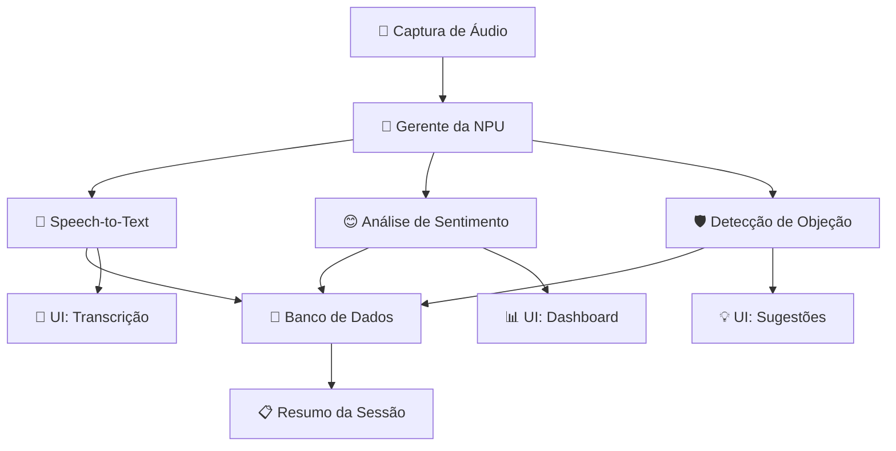

# 📁 Estrutura do Repositório PitchAI

##  Visão Geral

O PitchAI utiliza uma **arquitetura integrada** em Python, onde frontend (PyQt6) e backend (NPU + Audio) compartilham o mesmo processo para máxima performance e simplicidade de desenvolvimento.

---

## 📂 Estrutura Detalhada

```
PitchAI/
├── 📁 src/                          # 🎯 Código principal da aplicação
│   ├── __init__.py                  # Inicialização do módulo
│   ├── main.py                      # 🚀 Ponto de entrada principal
│   ├── main_frontend.py
│   │
│   ├── 📁 core/                     # 🏗️ Motor principal + EventBus + Config
│   │   ├── __init__.py
│   │   ├── application.py           # Classe principal PitchAIApp
│   │   ├── config.py               # Configurações centralizadas
│   │   ├── contracts.py             # Contratos de eventos imutáveis
│   │   ├── event_bus.py             # Sistema pub/sub thread-safe
│   │   ├── error_handler.py         # Tratamento robusto de erros
│   │   ├── performance_monitor.py   # Métricas em tempo real
│   │   └── cache_manager.py         # Sistema de cache inteligente
│   │
│   ├── 📁 ai/                      # 🤖 Pipeline de IA + Modelos
│   │   ├── __init__.py
│   │   ├── npu_manager.py          # Coordenador da NPU
│   │   ├── asr_whisper.py          # Transcrição em tempo real
│   │   ├── llm_service.py          # Serviço de LLM para geração
│   │   ├── anythingllm_client.py   # Cliente AnythingLLM offline
│   │   ├── sentiment/              # Análise de sentimento multi-dimensional
│   │   │   ├── sentiment_service.py
│   │   │   ├── text_analyzer.py
│   │   │   ├── prosody_analyzer.py
│   │   │   └── vision_analyzer.py
│   │   └── rag_service.py          # RAG para objeções
│   │
│   ├── 📁 audio/                   # 🎤 Processamento de áudio
│   │   ├── __init__.py
│   │   ├── capture.py              # Captura WASAPI do sistema
│   │   ├── preprocessing.py        # Preprocessamento de sinais
│   │   └── speaker_separation.py   # Separação de falantes
│   │
│   ├── 📁 ui/                      # 🎨 Interface PyQt6 + Bridge
│   │   ├── __init__.py
│   │   ├── main_window.py          # Janela principal
│   │   ├── bridge.py               # UiBridge - ponte EventBus ↔ PyQt6
│   │   ├── store.py                # UI Store - estado centralizado
│   │   ├── strings.py              # Strings centralizadas
│   │   ├── theme.py                # Tema glassmorphism
│   │   ├── dashboard_widget.py     # Dashboard com métricas NPU
│   │   ├── transcription_widget.py # Widget de transcrição
│   │   ├── suggestions_widget.py   # Sugestões RAG + AnythingLLM
│   │   ├── history_widget.py       # Histórico com busca FTS5
│   │   ├── summary_widget.py       # Resumos inteligentes
│   │   ├── controls_widget.py      # Controles de gravação
│   │   └── styles/                 # Estilos e temas
│   │       └── glassmorphism.qss   # Tema glassmorphism
│   │
│   ├── 📁 data/                    # 💾 Gerenciamento SQLite + DAOs
│   │   ├── __init__.py
│   │   ├── database.py             # Manager SQLite com FTS5
│   │   ├── models.py               # Modelos de dados Pydantic
│   │   ├── migrations/             # Migrações de banco
│   │   │   ├── 0003_mentor_client.sql
│   │   │   ├── 0004_disc.sql
│   │   │   └── 0005_stats.sql
│   │   ├── dao_disc.py             # DAO para sistema DISC
│   │   └── dao_mentor.py           # DAO para Mentor Engine
│   │
│   ├── 📁 disc/                    # 📊 Sistema DISC comportamental
│   │   ├── __init__.py
│   │   ├── extractor.py            # Extração de features linguísticas
│   │   ├── scorer.py               # Cálculo de scores DISC
│   │   ├── recommender.py          # Geração de planos de treino
│   │   └── batch.py                # Processamento em lote
│   │
│   ├── 📁 mentor/                  # 🎓 Mentor Engine + XP
│   │   ├── __init__.py
│   │   ├── mentor_engine.py        # Orquestrador principal
│   │   ├── coach_feedback.py       # Sistema de coaching
│   │   ├── xp_rules.py             # Regras de XP e gamificação
│   │   └── client_profile/         # 👥 Perfis de clientes
│   │       ├── __init__.py
│   │       ├── service.py
│   │       └── scorer.py
│   │
│   └── 📁 client_profile/          # 👥 Perfis de clientes
│       ├── __init__.py
│       ├── service.py              # Serviço de perfis
│       └── scorer.py               # Classificação e scoring
│
├── 📁 models/                      # 🧠 Modelos ONNX otimizados
│   ├── manifest.json               # Metadados dos modelos
│   ├── whisper_base/               # Transcrição
│   │   ├── encoder_model.onnx
│   │   └── decoder_model.onnx
│   ├── llama-3.2-3b-onnx-qnn/      # LLM AnythingLLM
│   │   ├── config.json
│   │   ├── tokenizer.json
│   │   └── *.bin (partes do modelo)
│   ├── embeddings/                 # Embeddings para RAG
│   │   └── model.onnx
│   └── sentiment/                  # Modelos de sentimento
│       ├── text_analyzer.onnx
│       └── prosody_analyzer.onnx
│
├── 📁 docs/                        # 📚 Documentação completa
│   ├── README.md                   # Documentação principal
│   ├── features.md                 # Features detalhadas (SRS)
│   ├── tech-stack.md              # Stack tecnológica
│   ├── repository-structure.md     # Este arquivo
│   ├── setup.md                   # Guia de instalação
│   ├── anythingllm_integration.md # Integração AnythingLLM
│   ├── transcription_integration.md # Frontend + Backend
│   ├── DISC_SYSTEM_IMPLEMENTATION.md # Sistema DISC
│   ├── MENTOR_ENGINE_IMPLEMENTATION.md # Mentor Engine
│   └── ui_integration.md          # Integração UI + EventBus
│
├── 📁 tests/                       # 🧪 Suite de testes abrangente
│   ├── test_npu_manager.py
│   ├── test_audio_capture.py
│   ├── test_event_bus.py
│   ├── test_database.py
│   ├── test_ui_widgets.py
│   ├── test_disc_system.py
│   ├── test_mentor_engine.py
│   └── test_anythingllm.py
│
├── 📁 scripts/                     # 🔧 Scripts utilitários
│   ├── setup_models.py            # Download de modelos
│   ├── benchmark_npu.py           # Benchmark NPU vs CPU
│   ├── populate_database.py       # Dados de teste
│   ├── prepare_models.py          # Preparação de modelos
│   └── deploy.py                  # Script de deployment
│
├── 📄 requirements.txt             # 📦 Dependências Python
├── 📄 .gitignore                  # Git ignore rules
└── 📄 README.md                   # Documentação principal
```

---

##  Arquitetura por Módulos

###  Core (`src/core/`)
**Responsabilidade**: Coordenação geral da aplicação
- `application.py`: Classe principal que orquestra todos os componentes
- `config.py`: Configurações centralizadas (NPU, áudio, UI, banco)
- `threading_manager.py`: Gerencia threads para operações NPU assíncronas

###  AI (`src/ai/`)
**Responsabilidade**: Pipeline de IA na NPU
- `npu_manager.py`: **CORE** - Orquestra modelos ONNX na NPU
- `asr_whisper.py`: Transcrição em tempo real com Whisper
- `llm_service.py`: Serviço de geração de texto com Llama 3.2
- `sentiment/`: Módulos para análise de sentimento multi-dimensional

###  Audio (`src/audio/`)
**Responsabilidade**: Captura e processamento de áudio
- `capture.py`: **CRÍTICO** - Captura WASAPI loopback do Windows
- `preprocessing.py`: Filtros, redução de ruído, normalização
- `speaker_separation.py`: Identificação e separação de falantes

###  UI (`src/ui/`)
**Responsabilidade**: Interface PyQt6 moderna
- `main_window.py`: Janela principal com layout glassmorphism
- `dashboard_widget.py`: Métricas em tempo real (NPU, sentimento, objeções)
- `transcription_widget.py`: Exibição de transcrição com speaker ID
- `suggestions_widget.py`: Sugestões inteligentes baseadas em RAG
- `controls_widget.py`: Controles de gravação e configurações

###  Data (`src/data/`)
**Responsabilidade**: Persistência e gerenciamento de dados
- `database.py`: Manager SQLite com schema otimizado para analytics
- `models.py`: Modelos Pydantic para validação de dados
- `migrations/`: Scripts de migração de banco

---

##  Fluxo de Dados


