# 📁 Estrutura do Repositório PitchAI

##  Visão Geral

O PitchAI utiliza uma **arquitetura integrada** em Python, onde frontend (PyQt6) e backend (NPU + Audio) compartilham o mesmo processo para máxima performance e simplicidade de desenvolvimento.

---

## 📂 Estrutura Detalhada

```
PitchAI/
├── 📁 src/                          # 🎯 Código principal da aplicação
│   ├── __init__.py                  # Inicialização do módulo
│   ├── main.py                      # 🚀 Ponto de entrada principal
│   ├── main_frontend.py
│   │
│   ├── 📁 core/                     # 🧠 Motor principal da aplicação
│   │   ├── __init__.py
│   │   ├── application.py           # Classe principal PitchAIApp
│   │   ├── config.py               # Configurações globais
│   │   └── threading_manager.py    # Gerenciador de threads NPU
│   │
│   ├── 📁 ai/                      # 🤖 Pipeline de IA na NPU
│   │   ├── __init__.py
│   │   ├── npu_manager.py          # Coordenador da NPU
│   │   ├── asr_whisper.py          # Transcrição em tempo real
│   │   ├── llm_service.py          # Serviço de LLM para geração
│   │   └── sentiment/              # Análise de sentimento
│   │
│   ├── 📁 audio/                   # 🎤 Processamento de áudio
│   │   ├── __init__.py
│   │   ├── capture.py              # Captura WASAPI do sistema
│   │   ├── preprocessing.py        # Preprocessamento de sinais
│   │   └── speaker_separation.py   # Separação de falantes
│   │
│   ├── 📁 ui/                      # 🎨 Interface PyQt6
│   │   ├── __init__.py
│   │   ├── main_window.py          # Janela principal
│   │   ├── dashboard_widget.py     # Dashboard de métricas
│   │   ├── transcription_widget.py # Widget de transcrição
│   │   ├── suggestions_widget.py   # Painel de sugestões IA
│   │   ├── controls_widget.py      # Controles de gravação
│   │   └── styles/                 # Estilos e temas
│   │       └── glassmorphism.qss   # Tema glassmorphism
│   │
│   └── 📁 data/                    # 💾 Gerenciamento de dados
│       ├── __init__.py
│       ├── database.py             # Manager SQLite
│       ├── models.py               # Modelos de dados Pydantic
│       └── migrations/             # Migrações de banco
│
├── 📁 models/                      # 🧠 Modelos ONNX otimizados
│   ├── whisper-base.onnx           # Modelo de transcrição
│   ├── distilbert-sentiment.onnx   # Análise de sentimento
│   ├── bert-objection.onnx         # Detecção de objeções
│   └── ecapa-speaker.onnx          # Separação de falantes
│
├── 📁 docs/                        # 📖 Documentação completa
│   ├── README.md                   # Documentação principal
│   ├── features.md                 # Features detalhadas
│   ├── tech-stack.md              # Stack tecnológica
│   ├── repository-structure.md     # Este arquivo
│   └── setup.md                   # Guia de instalação
│
├── 📁 tests/                       # 🧪 Testes automatizados
│   ├── test_npu_manager.py
│   ├── test_audio_capture.py
│   ├── test_database.py
│   └── test_ui_widgets.py
│
├── 📁 scripts/                     # 🛠️ Scripts utilitários
│   ├── setup_models.py            # Download de modelos
│   ├── benchmark_npu.py           # Benchmark NPU vs CPU
│   └── deploy.py                  # Script de deployment
│
├── 📄 requirements.txt             # 📦 Dependências Python
├── 📄 .gitignore                  # Git ignore rules
└── 📄 README.md                   # Documentação principal
```

---

##  Arquitetura por Módulos

###  Core (`src/core/`)
**Responsabilidade**: Coordenação geral da aplicação
- `application.py`: Classe principal que orquestra todos os componentes
- `config.py`: Configurações centralizadas (NPU, áudio, UI, banco)
- `threading_manager.py`: Gerencia threads para operações NPU assíncronas

###  AI (`src/ai/`)
**Responsabilidade**: Pipeline de IA na NPU
- `npu_manager.py`: **CORE** - Orquestra modelos ONNX na NPU
- `asr_whisper.py`: Transcrição em tempo real com Whisper
- `llm_service.py`: Serviço de geração de texto com Llama 3.2
- `sentiment/`: Módulos para análise de sentimento multi-dimensional

###  Audio (`src/audio/`)
**Responsabilidade**: Captura e processamento de áudio
- `capture.py`: **CRÍTICO** - Captura WASAPI loopback do Windows
- `preprocessing.py`: Filtros, redução de ruído, normalização
- `speaker_separation.py`: Identificação e separação de falantes

###  UI (`src/ui/`)
**Responsabilidade**: Interface PyQt6 moderna
- `main_window.py`: Janela principal com layout glassmorphism
- `dashboard_widget.py`: Métricas em tempo real (NPU, sentimento, objeções)
- `transcription_widget.py`: Exibição de transcrição com speaker ID
- `suggestions_widget.py`: Sugestões inteligentes baseadas em RAG
- `controls_widget.py`: Controles de gravação e configurações

###  Data (`src/data/`)
**Responsabilidade**: Persistência e gerenciamento de dados
- `database.py`: Manager SQLite com schema otimizado para analytics
- `models.py`: Modelos Pydantic para validação de dados
- `migrations/`: Scripts de migração de banco

---

##  Fluxo de Dados

```mermaid
graph TD
    A["🎤 Captura de Áudio"] --> B["🧠 Gerente da NPU"]
    B --> C["📝 Speech-to-Text"]
    B --> D["😊 Análise de Sentimento"]
    B --> E["🛡️ Detecção de Objeção"]
    
    C --> F["💾 Banco de Dados"]
    D --> F
    E --> F
    
    C --> G["🎨 UI: Transcrição"]
    D --> H["📊 UI: Dashboard"]
    E --> I["💡 UI: Sugestões"]
    
    F --> J["📋 Resumo da Sessão"]
```


