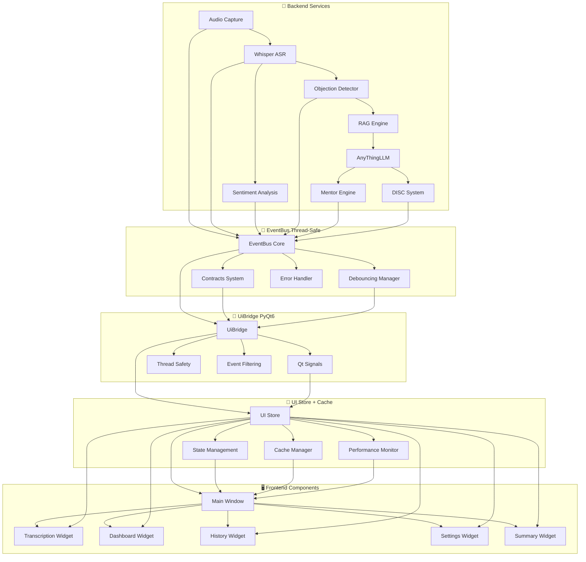

# Integração UI - EventBus e UiBridge

## ✅ **Status: IMPLEMENTADO E INTEGRADO**

A integração completa entre backend e interface gráfica (PyQt6) foi implementada com sucesso. Todos os dados simulados foram substituídos por dados reais do backend, criando uma experiência totalmente funcional.

## 🎯 Visão Geral

A integração entre o backend e a interface gráfica (PyQt6) é feita através de um sistema de eventos pub/sub thread-safe, garantindo comunicação eficiente e sem bloqueios. O sistema inclui:

- ✅ **Dados Reais**: Substituição completa de simulações por dados reais
- ✅ **EventBus Thread-Safe**: Comunicação robusta entre módulos
- ✅ **Sistema de Contratos**: Payloads padronizados e imutáveis
- ✅ **Debouncing Automático**: Performance otimizada
- ✅ **Cache Inteligente**: Aceleração de respostas na UI
- ✅ **Error Handling**: Recuperação automática de falhas

## 🏗️ Arquitetura da Integração



## Componentes Principais

### 1. EventBus (`src/core/event_bus.py`)

Sistema de eventos thread-safe que gerencia a comunicação entre módulos.

**Características:**
- Pub/sub pattern
- Worker thread dedicada
- Queue thread-safe
- Métricas em tempo real

**Uso:**
```python
from core.event_bus import publish_event, subscribe_to_event

# Publicar evento
publish_event("asr.chunk", payload)

# Inscrever em evento
subscribe_to_event("asr.chunk", callback)
```

### 2. Contratos (`src/core/contracts.py`)

Definições padronizadas de todos os tipos de eventos.

**Eventos principais:**
- `asr.chunk` - Chunks de transcrição
- `sentiment.update` - Atualizações de sentimento
- `objection.detected` - Objeções detectadas
- `rag.suggestions` - Sugestões RAG
- `summary.ready` - Resumo pronto
- `system.status` - Status do sistema
- `error` - Erros do sistema

### 3. UiBridge (`src/ui/bridge.py`)

Ponte entre EventBus e sinais PyQt6.

**Características:**
- Sinais `pyqtSignal(object)`
- Debouncing automático
- Conexão automática ao EventBus

**Sinais disponíveis:**
```python
ui_bridge.asr_chunk.emit(payload)
ui_bridge.sentiment_update.emit(payload)
ui_bridge.objection_detected.emit(payload)
ui_bridge.rag_suggestions.emit(payload)
ui_bridge.summary_ready.emit(payload)
ui_bridge.system_status.emit(payload)
ui_bridge.error.emit(payload)
```

### 4. UI Store (`src/ui/store.py`)

Estado centralizado da interface com janela deslizante.

**Características:**
- Thread-safe
- Cleanup automático
- Callbacks de mudança
- Métricas em tempo real

## Padrões de Eventos

### ASR Chunk
```python
{
    "call_id": "call_001",
    "source": "mic",  # ou "loopback"
    "ts_start_ms": 1234567890,
    "ts_end_ms": 1234567890,
    "text": "Texto transcrito",
    "confidence": 0.85
}
```

### Sentiment Update
```python
{
    "call_id": "call_001",
    "window_start_ms": 1234567890,
    "window_end_ms": 1234567890,
    "valence": 0.75,  # -1.0 a +1.0
    "engagement": 0.85,  # 0.0 a 1.0
    "sources": {
        "text": 0.8,
        "voice": 0.7,
        "vision": 0.6  # opcional
    },
    "details": {  # opcional
        "conf_text": 0.9,
        "conf_voice": 0.8
    }
}
```

### Objection Detected
```python
{
    "call_id": "call_001",
    "ts_ms": 1234567890,
    "category": "preco",  # preco/timing/autoridade/necessidade
    "confidence": 0.88,
    "context_snippet": "O cliente mencionou que o preço está alto"
}
```

### RAG Suggestions
```python
{
    "call_id": "call_001",
    "objection_id": "obj_001",
    "suggestions": [
        {
            "text": "Sugestão de resposta",
            "score": 0.92,
            "sources": [{"id": "doc1", "title": "Documento 1"}]
        }
    ],
    "retrieved": [
        {
            "id": "doc1",
            "title": "Documento 1",
            "snippet": "Trecho relevante..."
        }
    ]
}
```

## Debouncing e Performance

### ASR Events
- **Debouncing**: 150ms
- **Estratégia**: Último evento apenas
- **Motivo**: Alta frequência, baixa latência necessária

### Sentiment Events
- **Debouncing**: 100ms
- **Estratégia**: Último evento apenas
- **Motivo**: Atualizações frequentes, gráfico em tempo real

### Outros Events
- **Debouncing**: Nenhum
- **Estratégia**: Todos os eventos
- **Motivo**: Importantes, baixa frequência

## Integração na UI

### 1. Conectar UiBridge
```python
from ui.bridge import create_ui_bridge

class MainWindow(QMainWindow):
    def __init__(self):
        self.ui_bridge = create_ui_bridge()
        self.setup_connections()
    
    def setup_connections(self):
        self.ui_bridge.asr_chunk.connect(self.on_asr_chunk)
        self.ui_bridge.sentiment_update.connect(self.on_sentiment_update)
        # ... outros sinais
```

### 2. Handlers de Eventos
```python
@pyqtSlot(object)
def on_asr_chunk(self, payload):
    source = payload['source']
    text = payload['text']
    # Atualizar componente de transcrição
    
@pyqtSlot(object)
def on_sentiment_update(self, payload):
    valence = payload['valence']
    engagement = payload['engagement']
    # Atualizar gráfico de sentimento
```

### 3. Usar UI Store
```python
from ui.store import get_ui_store

ui_store = get_ui_store()

# Adicionar dados
ui_store.add_transcript_chunk(source, t0, t1, text, confidence)
ui_store.add_sentiment_update(window_start, window_end, valence, engagement)

# Obter estado
state = ui_store.get_state()
transcript = state['transcript']['mic']
```

## Temas e Strings

### Temas (`src/ui/theme.py`)
- Cores centralizadas
- Ícones Unicode
- Estilos CSS
- Paletas Qt

### Strings (`src/ui/strings.py`)
- Labels da interface
- Mensagens do sistema
- Tooltips
- Placeholders

## Testes

### Teste de Integração
```bash
cd Test
python test_ui_integration.py
```

### Smoke Test
```bash
cd Test
python test_smoke_ui.py
```

## Checklist de Integração

- [ ] EventBus iniciado no boot
- [ ] UiBridge conectado ao EventBus
- [ ] Sinais conectados aos slots da UI
- [ ] UI Store configurado
- [ ] Debouncing configurado
- [ ] Temas aplicados
- [ ] Strings centralizadas
- [ ] Testes passando

## Troubleshooting

### Eventos não chegando na UI
1. Verificar se EventBus está rodando
2. Verificar conexões do UiBridge
3. Verificar slots conectados
4. Verificar logs de erro

### Performance ruim
1. Verificar debouncing configurado
2. Verificar cleanup do UI Store
3. Verificar tamanho da fila do EventBus
4. Verificar métricas

### Erros de import
1. Verificar PYTHONPATH
2. Verificar imports relativos
3. Verificar dependências PyQt6

## Próximos Passos

1. **Componentes de UI**: Implementar widgets específicos
2. **Persistência**: Integrar com SQLite
3. **Telemetria**: Adicionar métricas de UX
4. **Export**: Implementar exportação de dados
5. **Configurações**: Interface de configuração 